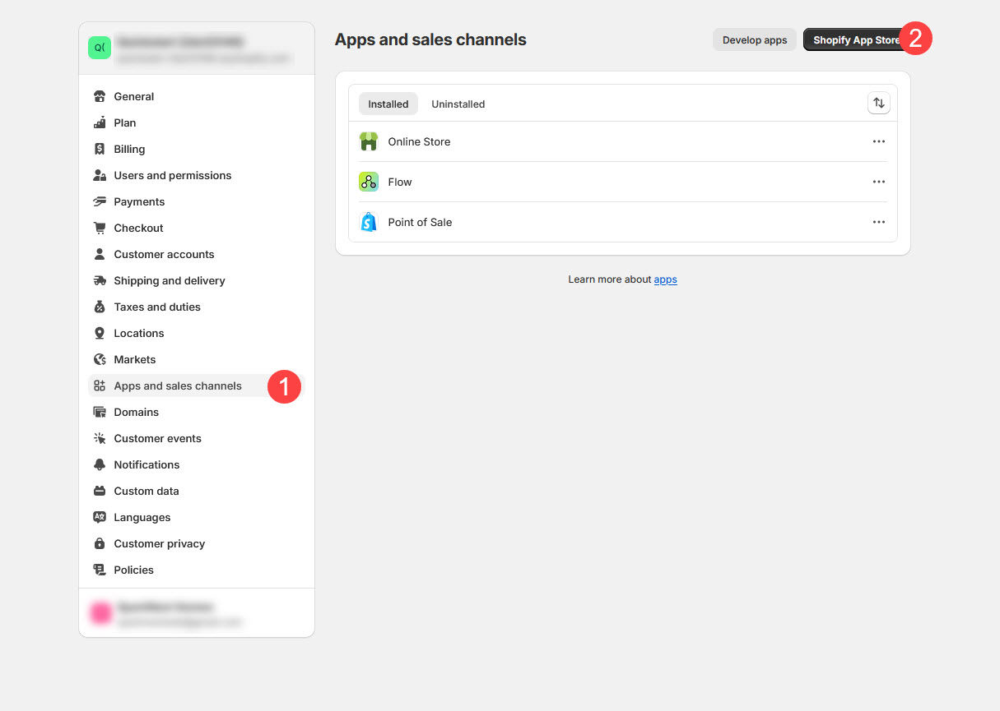
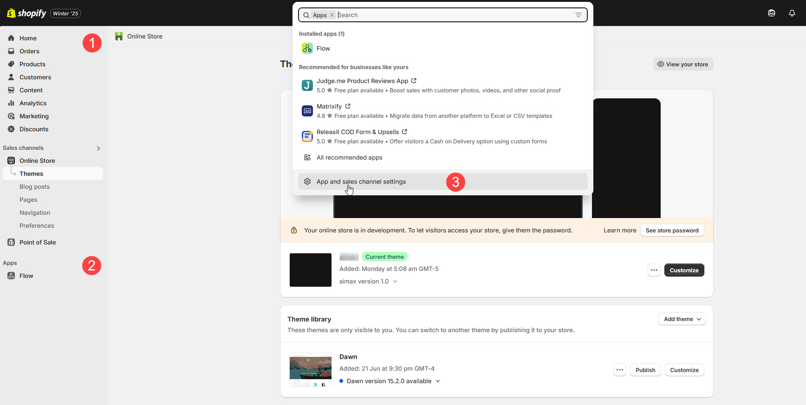
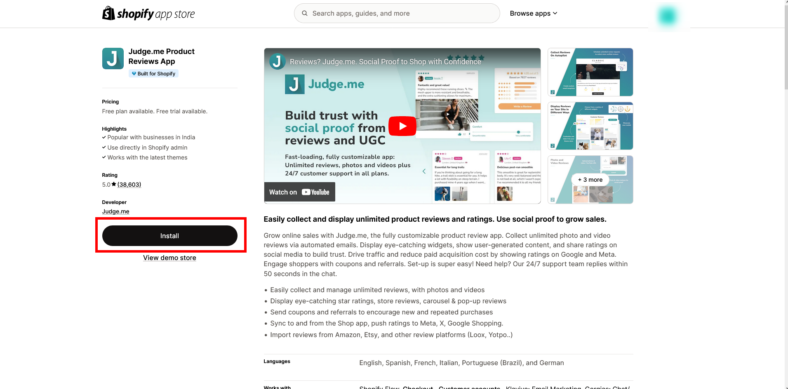
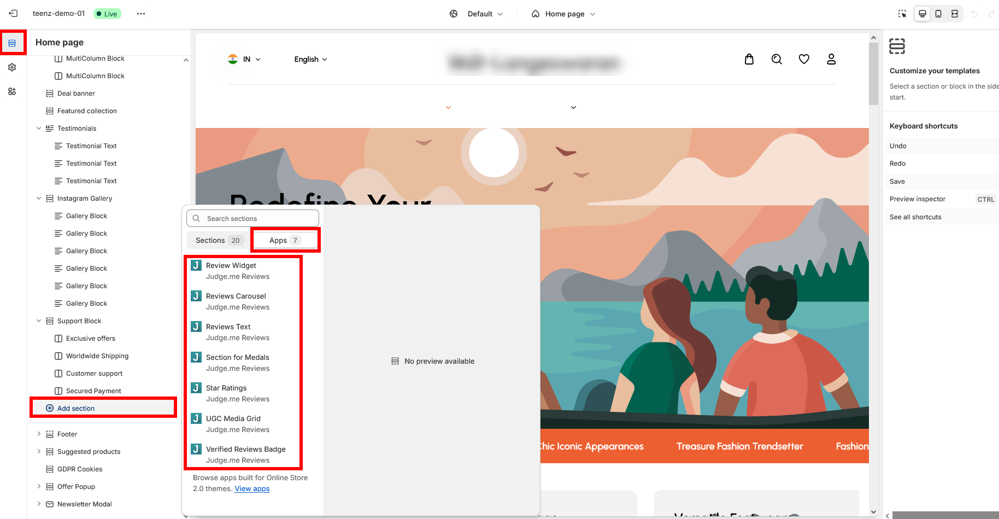
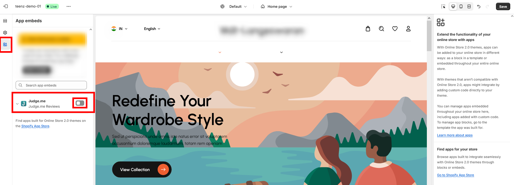

# App Integration

Shopify allows you to enhance the functionality of your store through apps. Apps can help you with a wide range of tasks, including managing products, optimizing SEO, improving customer experience, and automating processes.

**App integration** with the Shopify Customizer allows third-party apps to add features and settings directly into the store's theme layout. This enables store owners to customize the appearance and functionality of these app features without needing to edit any code.

### **Install the App**


* Go to the Shopify App Store from your **Shopify admin panel.**
* In your admin panel, select **Settings**, and then choose **Apps and sales channels**


<figure><figcaption></figcaption></figure>

* The **Apps** section will display a list of all apps that have been installed on your store. You can manage these apps directly from this page.
* **Access the Shopify App Store:** To install new apps, click on the **Shopify App Store** from your Shopify admin panel.
* **Search for the App:** Use the search bar to find the app you want to install.
* **Access the Shopify App Store:** Once you've found the app, click **Install**

<figure><figcaption></figcaption></figure>

<figure><figcaption></figcaption></figure>

### **Viewing Installed Apps in the Shopify Customizer**


**Step 1 :** In your Shopify admin, Navigate to **Online Store** > **Themes**, and click on **Customize** to open the theme editor.

**Step 2 :** In the theme editor, click on **Sections** in the left-hand sidebar.

**Step 3 :** Click on the **Add section** to add a new section to your theme.

**Step 4 :** Choose **Apps** from the list of available sections.

**Step 5 :** You will see a list of the apps that have been installed on your store, and you can  **embed** them into your theme as needed.


<figure><figcaption></figcaption></figure>

### **Enabling Installed Apps in the Shopify Customizer**


**Step 1 :** In your Shopify admin, go to **Online Store > Themes**_**,**_ then click **Customize** to open the theme editor.

**Step 2 :** In the theme editor, click on **App embeds** in the left-hand sidebar.

**Step 3 :** Locate the app you want to enable and click the **Enable** button to activate the app within your theme.

**Step 4 :** After enabling the app, you can further customize its settings and appearance as needed.


<figure><figcaption></figcaption></figure>
