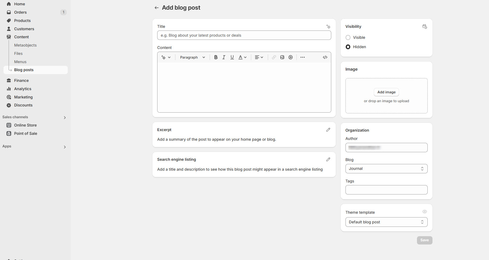

# Creating Blog

Shopify allows you to create and manage blogs to share updates, news, and guides, helping to improve SEO and customer engagement. To access the blog in the **Shopify Theme Customizer**, the blog must first be **created** in Shopify, and an **option should be added** in the theme settings to allow customization.


* **Go to**   **Shopify Dashboard >Content > Blog Posts**.
* Click **Add Blog Post**.
* A pop-up appears for adding content. Ensure the blog post is visible on the page.


1. **Title:** Enter a blog title (e.g., **"Top 10 Art Trends of 2024"**).
2. **Content:** Add text, images, videos, or embedded content.
3. **Image:** Upload a thumbnail image for the blog post.&#x20;
4. **Author:** Select or create an author name.
5. Scroll to **Organization** and select a blog category.
   * Default is **"News"** (Create a new blog category if needed).
6. Click **Manage Blogs** to create and organize multiple blog categories.
7. **Tag:** In a Shopify blog help categorize and organize posts, making it easier for customers to find relevant content.
8. Click **Save** to store changes.
9. Set the blog visibility to visible allow access to the blog hidden to hide.
10. Created **Blog** should be assigned on customize for the visibility

<figure><figcaption></figcaption></figure>
