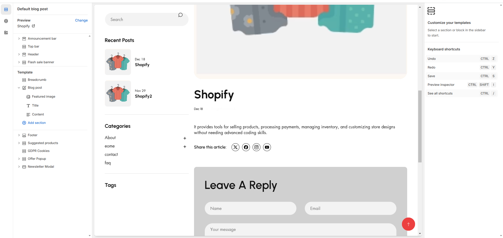

# Default blog post

A **blog post** in Shopify is an individual article published within a **Shopify blog**. It helps businesses share updates, industry news, product guides, and other engaging content to attract and retain customers.

* **Show Full Width:** Expands the section across the entire screen width.
* **Right & Left Spacing :** Add **spacing** to the **Full Width** layout (applies  in full-width mode).
* **Padding:** Top Padding and Bottom Padding are used to adjust the spacing above and below a section in Shopify, improving the layout and readability.
* **Show article:**&#x53;how the recent article of the blog on sidebar
* **Show Sidebar Excerpts :** Option to display excerpts in the sidebar for a quick preview of articles.
* **Show Tags:** Display associated tags for each blog post. Additionally, there is an option to select specific tags to filter the displayed posts.

### Recent article

* The **Recent Articles** section in a Shopify blog displays the latest published blog posts. It helps improve engagement by showing fresh content to visitors.&#x20;
* Allows to add heading for the articles and can adjust the limit of the article using range and add tag&#x20;

### **Promo Banner** 

* **Show Promo:** Enable or disable displaying the promotional section to the blog layout.
* **Image:** Upload or select an image to display in the promo section.
* **Heading:** Set a custom heading for the promo section.
* **Button:** Add a call-to-action button to the promo section.
* **Link:** Provide a URL for the button to direct users to a specific page or resource.

### **Product List** 

* **Enable:** Enable or disable displaying the Product List section within the blog layout.
* **Heading :** Set a custom heading for the product list section.
* **Collection:** Select collection.
* **Limit:** Limit the number of products shown in the product list.

### Menu

* **Enable:** This option allow to enable the menu
* **Heading:** Add heading to menu
* **Collection:** Can select menu required to show in sidebar

<figure><figcaption></figcaption></figure>

