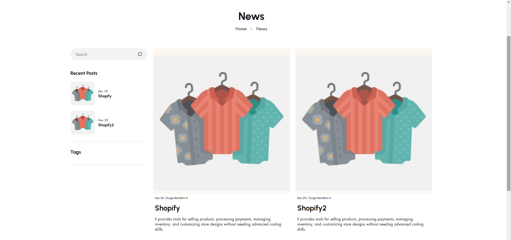
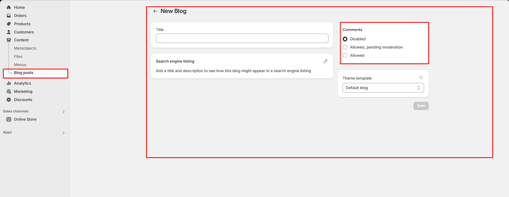
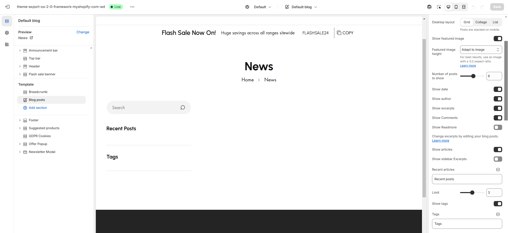
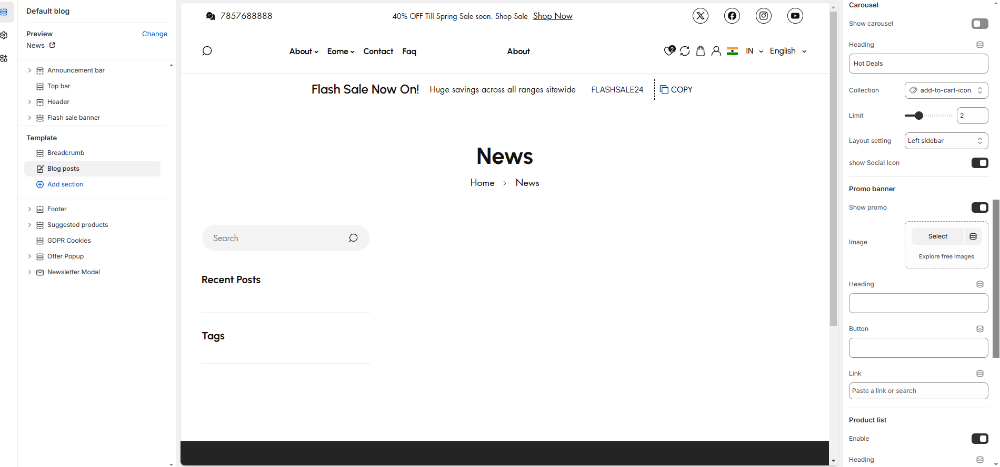
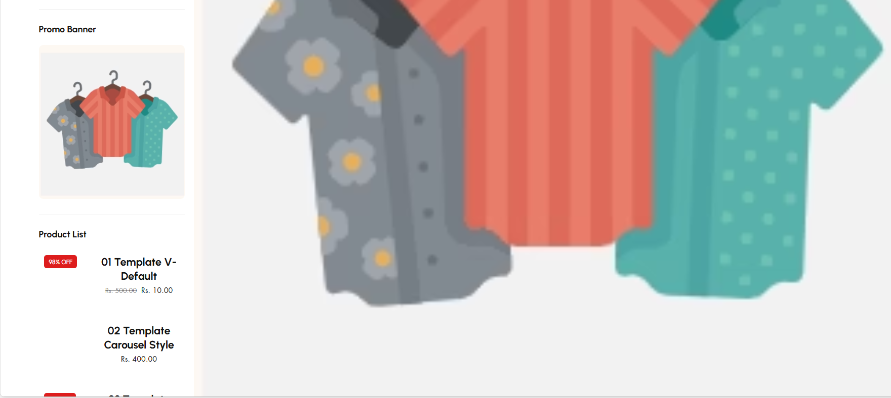

# Default blog

A **blog on Shopify** is a built-in feature that allows store owners to create and manage blog posts directly within their online store. It helps businesses engage with customers, improve SEO, and drive more traffic to their products.The blog should be **created** from backend to assign in customizer\

<figure><figcaption></figcaption></figure>

* **Show Full Width:** Expands the section across the entire screen width.
* **Right & Left Spacing :** Add **spacing** to the **Full Width** layout (applies  in full-width mode).
* [**Custom class:** ](../sections/custom-class.md)The Shopify allows you to apply unique CSS styles to specific sections, blocks, or elements within your theme.&#x20;
* **Desktop layout:** Blog can be styled in 3 format **(Grid,Collage)**
* **Show featured image:** The Blog image can be disable if required using toggle option
* **Featured image height:** Image can be adjusted in height using **(adapt to image,small,medium,large)**  option.
* **Number of posts to show:**&#x54;he blog post can be limit using post to show range
* **Date**: Displays the publication date of the blog post.
* **Author**: Displays the name of the person who wrote the blog.
* **Excerpt Display**: Choose whether to display a short summary of each blog post.
* **Recent article:**&#x54;o add the recently viewed article
* **Tags:**&#x54;ags added in blog will use to filter and view.
* **Comment**: Displays the number of comments or allows visitors to see and leave comments.


Comment should be enabled in the back-end  **Dashboard > Blog post > Manage Blogs (top of the blog post dashboard panel) > Add Blog > Allowed**


<figure><figcaption></figcaption></figure>

* **Show Article:** Enable or disable displaying the full article content within the blog layout.
* **Recent Article:** Highlight or feature the most recent article in the blog layout.
* **Limit for Blogs:** Set a maximum number of blog posts to display at once.
* **Show Tags:** Display associated tags for each blog post. Additionally, there is an option to select specific tags to filter the displayed posts.

<figure><figcaption></figcaption></figure>

### **Carousel** 

* **Show Carousel:** Add a carousel to display featured blog posts.
* **Heading :** Set a custom heading for the carousel section.
* **Collection :** Choose a collection of blog posts or images to include in the carousel.
* **Limit:** Set a maximum number of items to display in the carousel.
* **Layout Settings:** There are three options for blog layout settings:
* **Right Sidebar:** Display a sidebar on the right side of the blog layout.
* **Left Sidebar:** Display a sidebar on the left side of the blog layout.
* **No Sidebar:** Remove the sidebar for a full-width blog layout.
* **Show Social Icon:** Enable this option to display social media icons for easy sharing of blog posts.

### **Promo Banner** 

* **Show Promo:** Enable or disable displaying the promotional section to the blog layout.
* **Image:** Upload or select an image to display in the promo section.
* **Heading:** Set a custom heading for the promo section.
* **Button:** Add a call-to-action button to the promo section.
* **Link:** Provide a URL for the button to direct users to a specific page or resource.

### Menu

* Can select the created menu to display in the sidebar

### **Product List** 

* **Enable:** Enable or disable displaying the Product List section within the blog layout.
* **Heading :** Set a custom heading for the product list section.
* **Collection:** Select collection.
* **Limit:** Limit the number of products shown in the product list.

<figure><figcaption></figcaption></figure>

<figure><figcaption></figcaption></figure>
