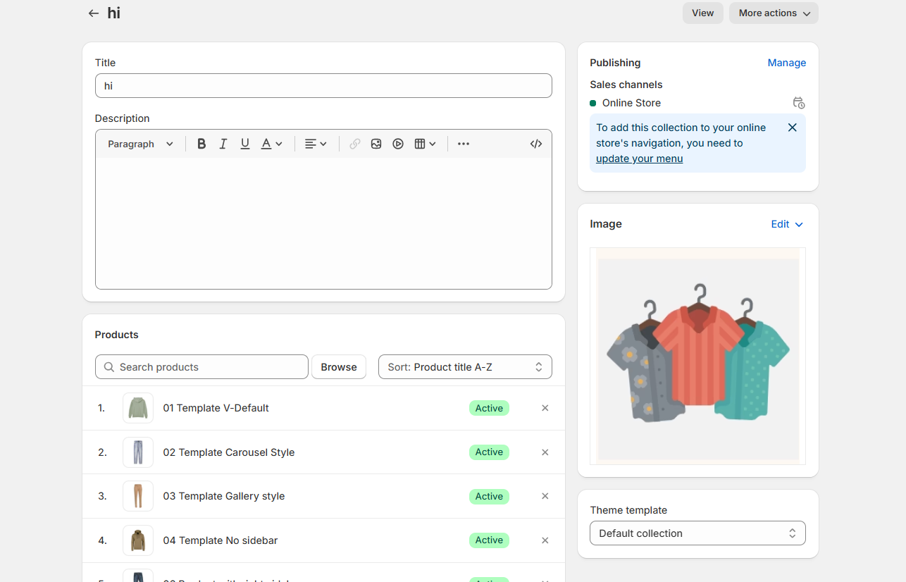

# Collection Banner

A **collection banner** in Shopify is a large image that appears at the top of a collection page. It serves as a visual introduction to the products within that collection, helping to set the tone and highlight key items.


**Step 1 :** In your **Shopify admin,** > **Product > Collections.**

**Step 2 :** Select the collection you want to add a banner image.[**(creating collection)** ](creating-collections.md)

**Step 3 :**  Scroll down to the "Collection image" section.

**Step 4 :** Click **"Add image"** and upload your banner image.

**Step 5 :**  Click **"Save".**



The created collection should be added with the image which will allows to show as **collection banner**


<figure><figcaption></figcaption></figure>

* **Go to** Shopify Admin > **Online Store > Themes**.
* Click **Customize** on your active theme > **Default collection > Click > Collection banner**
* **Show Full Width:** Expands the section  across the entire screen width.&#x20;
* **Right & Left Spacing :** Add **spacing** to the **Full Width** layout (applies  in full-width mode).
* **Show collection description:**&#x4F;n enabling the toggle the collection description will be enabled
* **Show collection image:** On enabling the toggle the collection image will be enabled **.**
* **Color scheme :** You can customize the section’s appearance by changing the text color, background color, and more using preset color options.
* **Padding:** Top Padding and Bottom Padding are used to adjust the spacing above and below a section in Shopify, improving the layout and readability.

<figure><figcaption></figcaption></figure>
