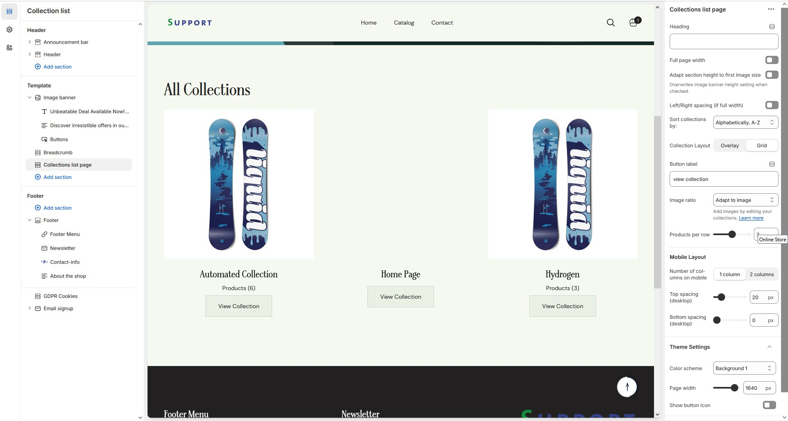

# Collection List

A **Collection List** allows you to showcase multiple collections together on a single page, making it easier for customers to navigate through different product categories.


* Navigate to **Shopify Admin > Products > Collections**.
* Click **Create Collection** and add at least two collections.
  * **Examples:** "New Arrivals," "Best Sellers," "On Sale."


### **How to Add a Collection List**

* Navigate to **Shopify Admin > Products > Collections**.
* Click [**Create Collection** ](creating-collections.md)and add at least two collections.
  * **Examples:** "New Arrivals," "Best Sellers," "On Sale."
* **Go to Shopify Admin > Online Store > Themes**.
* Click **Customize** on your active theme.
* In the theme editor, click **Add Section > Collection List**.
* **Show Full Width:** Expands the section across the entire screen width.
* **Right & Left Spacing Toggle :** Add **spacing** to the **Full Width** layout (applies  in full-width mode).e)
* **Heading:** Set a custom title (e.g., "Hot & Top Trends").&#x20;
* **Heading Size:** Choose for size Small, Medium, or Large&#x20;
* **Subheading:** Add additional text if needed. Body Text: Add a description (e.g., "Best arrivals this week").&#x20;
* **Button Label:** Add text (e.g., "Shop Now").
* &#x20;**Button Link:** Set the URL destination.&#x20;
* &#x20;**Color scheme :** You can customize the section’s appearance by changing the text color, background color, and more using preset color options.
* &#x20;**Enable Outline Button:** Change the button to an outlined style.&#x20;
* **Column alignment:** Column can be aligned as per the content alignment requirement (Left,Right)
* **Image ratio:** The ratio image can be alter using Square, Potrait and Adapt image option.
* **Number of columns on desktop:**&#x41;llows to enable the number if collection in desktop
* &#x20;**Enable "View all" button if list includes more collections than shown:**&#x41;llow to enable the view button allow to view all created collection
* **Padding:** Top Padding and Bottom Padding are used to adjust the spacing above and below a section in Shopify, improving the layout and readability.
* **Slider option:** The range for displaying products can be adjusted based on the device type **(Desktop, Laptop, Tablet, and Mobile)** to ensure a responsive layout.
* &#x20;**Pagination** (**Dots):** Show navigation dots for better user interaction.&#x20;
* **Navigation (Arrows):** Enable left/right navigation arrows.
* &#x20;**Auto Play Interval:** Set the time delay between slides.
* &#x20;**Enable Swipe:** Allow users to swipe through blocks on touch devices.
* &#x20;**Enable Controls:** Display manual navigation options
* &#x20;**Column on mobile:** Adjust based on mobile screen size can adjust to 1 column or 2 column.


Without adding block to Collection list the section seems to be empty


* Choose the **collection** to the block. Created in Backend
* Select and **Add Collection to block**
* Click **Save**

<figure><figcaption></figcaption></figure>
