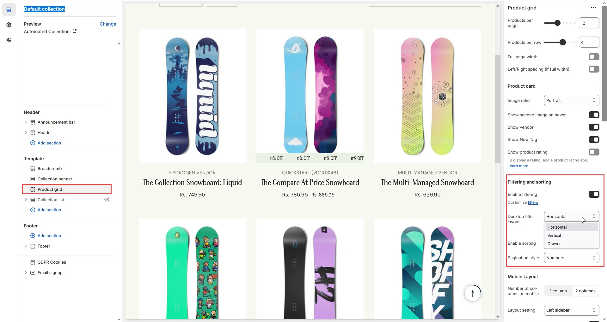

# Drawer Filter

A **Drawer Filter** in Shopify refers to a filtering system that is displayed in a sidebar on the left or right side of a collection or search page. This layout is one of the most common designs for e-commerce stores as it allows for multiple filtering options to be shown simultaneously without taking up too much horizontal space.

### **Steps to Enable vertical Filters in Shopify**


* **Go to** Shopify Admin > **Online Store > Themes**.
* Click **Customize** on your active theme.
* In the theme editor, navigate to the **Default Collection Pages, Blog Pages, or Product Pages** section.
* Look for an option to **Filtering and sorting > Enable Filtering** (select drawer filter).
* Customize the filter appearance as needed.


<figure><figcaption></figcaption></figure>
