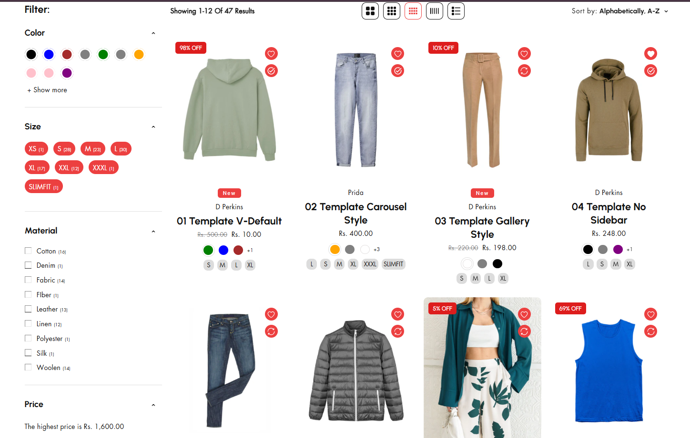
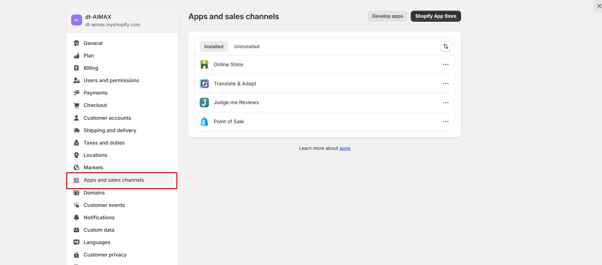
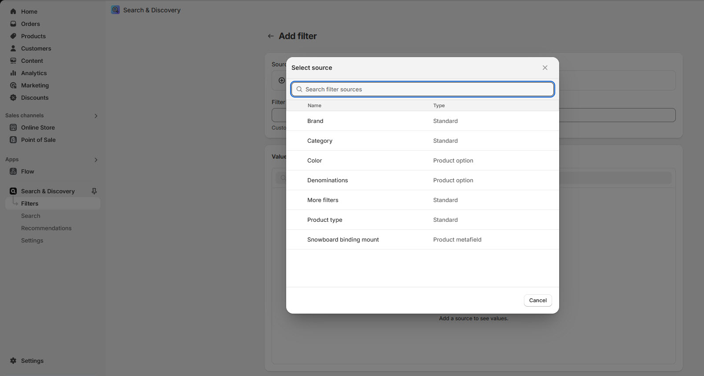

# Filters

In Shopify, product filters are a key feature of the **Search & Discovery** functionality, enabling customers to refine their search on **collection pages** or **search results pages**. These filters are usually presented as a **sidebar** or a **dropdown menu** for easy navigation.

<figure><figcaption></figcaption></figure>

### **Product Filters**

* **Price Filter**:  Allows customers to filter products based on a specific price range **(e.g., $0–$50, $50–$100).**
* **Size Filter**: Displays available sizes, like **Small**, **Medium**, or **Large**, for clothing, shoes, and accessories.
* **Color Filter**: Helps customers filter by color options, ideal for fashion, decor, or art products.
* **Category/Type Filter**: Filters products by specific categories or types (e.g., **Shirts**, **Pants**, **Jackets**).
* **Brand/Manufacturer Filter**: Allows filtering by brand or vendor (e.g., **Nike**, **Adidas**).
* **Material Filter**: Filters products by material properties (e.g., **Cotton**, **Leather**, **Metal**).
* **Custom Filters**: Uses custom product properties for unique filters, such as **Occasion**, **Style**, or **Features** (e.g., **Eco-friendly**, **Waterproof**).

<figure><figcaption></figcaption></figure>

### **How to Add Search & Discovery in Shopify**

1. **Go to the Shopify App Store**: In your Shopify Admin, click **Apps** in the left-hand menu.
2. Click the **Shopify App Store**&#x20;
3. In the App Store search bar, type **"Search & Discovery"**.Make sure to select the **official Shopify app**.
4. **Install the App**: Click the **Add app** button on the Search & Discovery app page.Confirm the installation by clicking **Install app**.
5. **Access the App**: Once installed, go to your Shopify Admin. Navigate to **Apps > Search & Discovery** to start using it.By adding required filter and its visible on the Product grid page.

\

<figure><figcaption></figcaption></figure>
