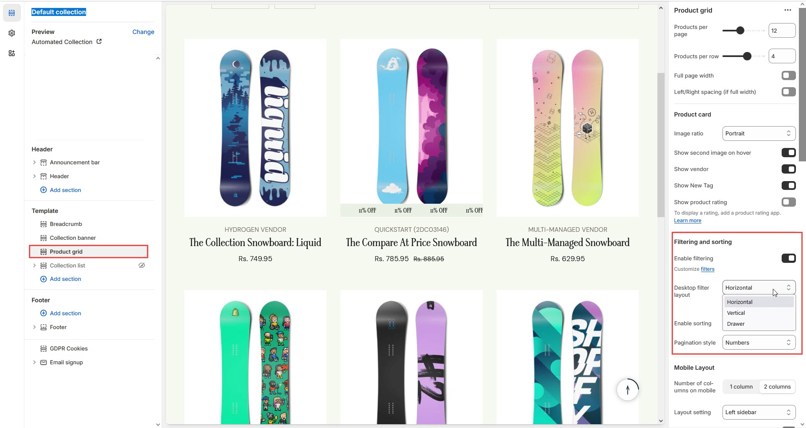

# Horizontal Filter

A **horizontal filter** in Shopify allows customers to filter products on collection pages or search results using a horizontal filter bar, providing a cleaner, modern look that is especially mobile-friendly.

### **Steps to Enable Horizontal Filters in Shopify**


**Enable Sidebar** : Horizontal filters are displayed as part of the sidebar filter, so make sure your sidebar is enabled first.



* **Go to** Shopify Admin > **Online Store > Themes**.
* Click **Customize** on your active theme.
* In the theme editor, navigate to the **Default Collection Pages, Blog Pages, or Product Pages** section.
* Look for an option to **Filtering and sorting > Enable Filtering** (select horizontal filter).
* Customize the filter appearance as needed.


### **Tips for Horizontal Filters**

1. **Use Dropdowns or Collapsible Menus**:
   * If you have many filter options (such as size, color, price), it’s a good idea to use dropdowns or collapsible menus to keep the filter bar clean and organized.
2. **Test for Responsiveness**:
   * Make sure the horizontal filter looks great on both **desktop** and **mobile** devices.
   * Check that all filter options are still easily accessible on smaller screens and that the layout doesn’t look cluttered.

### **How to Customize the Product Grid**

<figure><figcaption></figcaption></figure>
