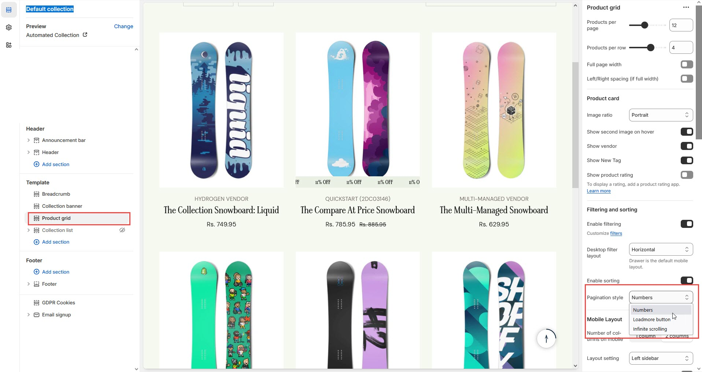

# Paginations

Pagination helps organize large collections or search results by dividing them into multiple pages, making it easier for customers to navigate and improving page load times. There are three main types of pagination you can enable on your Shopify store:

### **Types of Pagination**

1. **Infinite Scroll**: Automatically loads more products as the customer scrolls down the page.
   * Ideal for a seamless user experience without clicking through multiple pages.
2. **Number Pagination**: Displays numbered links (e.g., "1, 2, 3...") allowing customers to navigate through product pages.
3. **Load More Button**: Replaces traditional numbered pagination with a **"Load More"** button.
   * Clicking the button dynamically loads additional products without changing the page.

<figure><figcaption></figcaption></figure>

### **How to Enable Pagination in Shopify**

* **Go to Shopify Admin**: From your Shopify admin, navigate to **Online Store** > **Themes**.
* **Customize Theme**: Select **Customize** next to your current theme to open the theme editor.
* **Navigate to Default Collection**: In the theme editor, go to **Default Collection** or any other collection page where you want to enable pagination.
* **Product Grid**: Look for the **Product Grid** section, which controls how products are displayed.
* Check for pagination settings in this section and choose from the available options: **Number Pagination**, **Load More**, or **Infinite Scroll**.
* **Save Changes**: After adjusting the pagination settings, make sure to **Save** your changes.

### **Additional Notes**

* **Theme Customization**: Not all themes support all types of pagination. If your theme does not support a certain type, you may need to use third-party apps or custom code to enable it.
* **Responsive Design**: Ensure that pagination (especially infinite scroll or load more) works well on mobile devices to provide a smooth browsing experience.
