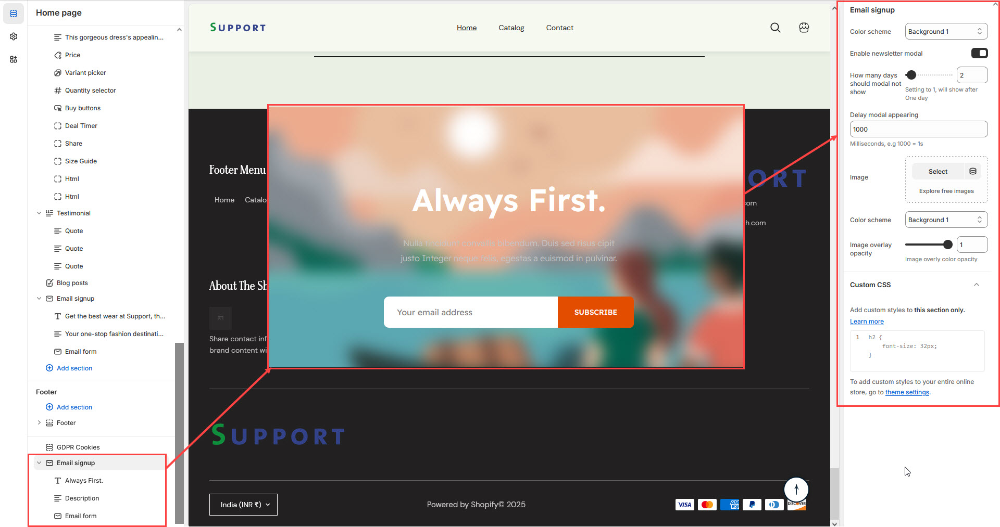

# Email Signup

The **Email Signup Block** in the Footer Section allows customers to **subscribe to your newsletter**, helping you grow your email marketing list. It includes a **newsletter modal** popup with customizable delay settings and background images.


* **Go to** Shopify Admin > **Online Store > Themes**.
* Click **Customize** on your active theme.
* Navigate to **Footer Section > Add Block > Email Signup**.
* Configure the settings as needed.


* **Color scheme :** You can customize the section’s appearance by changing the **text color, background color**, and more using preset color options.
* **Background Opacity:**&#x54;his options adds overlay opacity to the popup&#x20;
* **Enable Newsletter Modal:** Display a popup for email subscription in the theme
* **How Many Days Should Modal Not Show:** Set how often the modal reappears (e.g., **Setting to 1 = Shows after 1 day**).
* **Delay Modal Appearing:** Set the time before the modal appears (**1000ms = 1 second**).
* **Text alignment:** Add the alignment to the  email signup **(Left,Right, Center)**
* **Upload Image:** Add a background image for the newsletter popup.
* **Enable social icons:**&#x45;nable the social icons to the email signup

<figure><figcaption></figcaption></figure>
