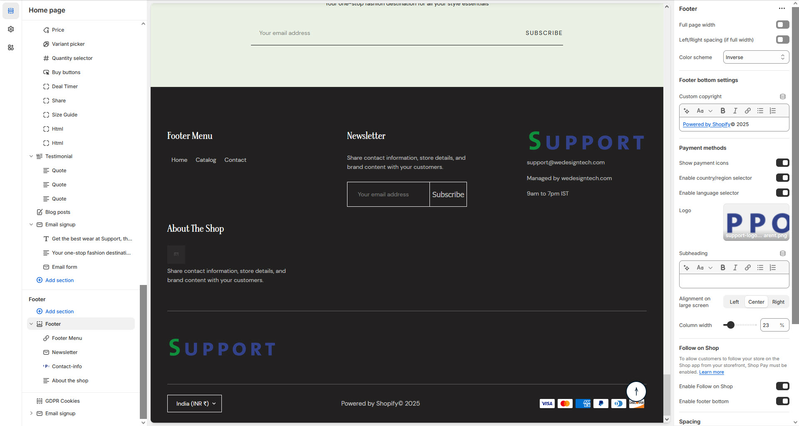

# Footer

A footer on a website provides essential information like contact details, navigation links, and legal disclaimers. It also often includes social media links, copyright notices, and call-to-action buttons.


* **Go to** Shopify Admin > **Online Store > Themes**.
* Click **Customize** on your active theme.
* Navigate to **Footer Section** and configure settings as needed.


<figure><figcaption></figcaption></figure>

* **Show Full Width:** Expands the section across the entire screen width Right & Left.
* **Right & Left Spacing :** Add **spacing** to the **Full Width** layout (applies  in full-width mode).
* **Color scheme** : You can customize the section’s appearance by changing the text color, background color, and more using preset color options.
* **Background Image:** Upload a custom background image if its require to the theme.
* **Show Social Media Icons:** Display social icons (configured in **Theme Settings**).
* **Custom Copyright :** Modify copyright message at the bottom(**e.g., "All Rights Reserved © 2025"**).
* **Show Payment Icons:** Show available payment methods.
* **Enable Default Style:** Use Shopify’s default styling for footer.
* **Enable  Border Right:** Add a right-side border for visual separation in footer.
* **Top Margin:** Adjust the external spacing above the footer.
* **Enable  Accordion :** Collapse footer sections into an accordion layout on mobile devices.
* **Top Padding:** Adjust the space above the footer.
* **Bottom Padding:** Adjust the space below the footer.

### How to Add a Block to the Footer Section


* In the **Theme Editor**, navigate to **Footer Section > Add Block**.
* Choose from the available blocks (**Menu, Newsletter, Footer Text, Contact Info, or App Block**).
* Configure the settings for each block as needed.

