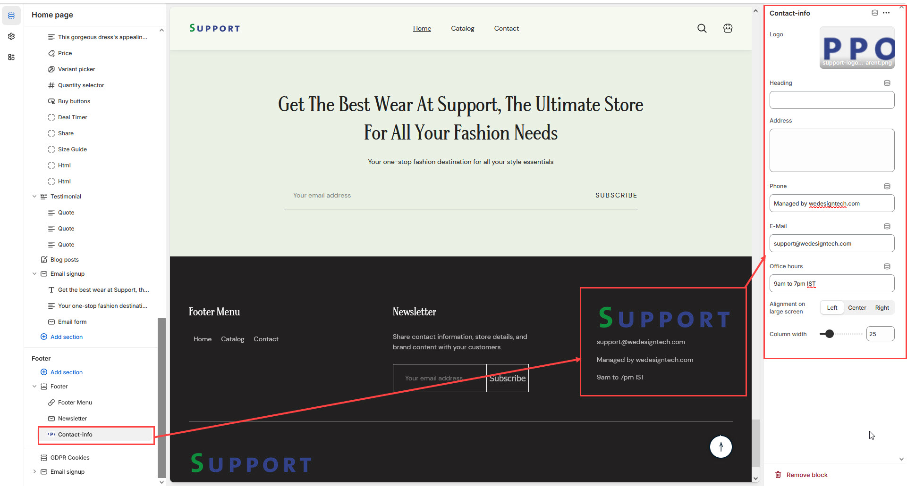

# Contact Info Block

The **Contact Info Block** in the Footer Section allows you to display your store’s **address, phone number, email, and office hours**, making it easy for customers to get in touch with you.


* **Go to** Shopify Admin > **Online Store > Themes**.
* Click **Customize** on your active theme.
* Navigate to **Footer Section > Add Block > Contact Info**.
* Configure the settings as needed.


* **Logo :** Upload Image  Add a company logo for branding.
* **Heading:** Set a title for the contact information section.
* **Address:** Enter the store’s physical address.
* **Phone:** Provide a contact number.
* **E-Mail:** Add a customer support or business email.
* **Office Hours:** Display working hours.
* **Alignment on Large Screens:** Adjust the positioning of the content for desktop view **(Left,Right,Center).**

<figure><figcaption></figcaption></figure>
