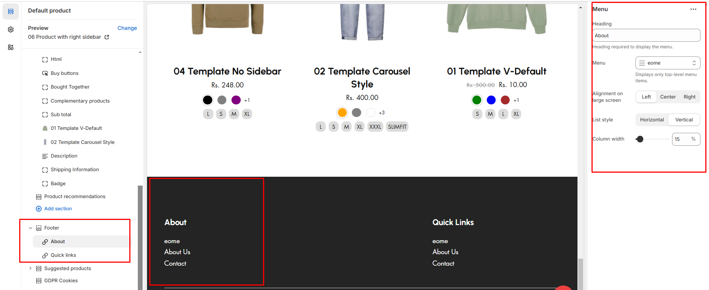

# Menu

The **Menu Block** in the Footer Section allows you to display **navigation links**, providing quick access to important pages such as **About Us, Contact, FAQs, Policies, and Categories**.


* **Go to** Shopify Admin > **Online Store > Themes**.
* Click **Customize** on your active theme.
* Navigate to **Footer Section > Add Block > Menu**.
* Configure the settings as needed.


<figure><figcaption></figcaption></figure>

* **Heading:** Adds heading to the footer menu
* **Menu:** Choose a menu to display in the footer added in [**Navigation**](https://wedesignthemes.gitbook.io/ai-max-ai-games/~/changes/270/header-group/navigation-menu).


**Note:**&#x44;isplays Only Top-Level Menu Items submenu items will not be shown.


* **Alignment on large screen:** Adjust the menu alignment for **desktop layouts(Left,Right,Center)**.
* **List style:** Choose the style of menu items are displayed (**Horizontal,Vertical**).
