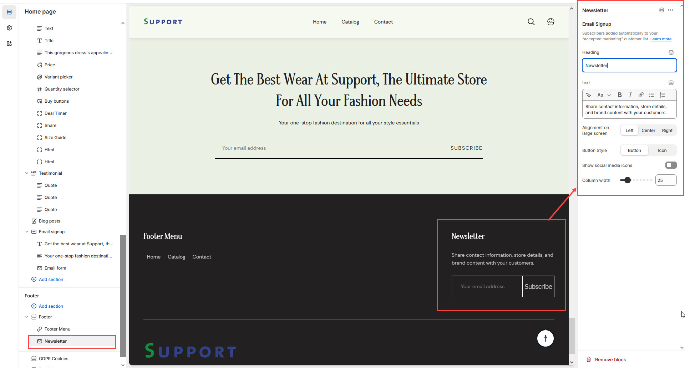

# Newsletter

The **Newsletter Block** in the Footer Section allows customers to **subscribe to email updates, promotions, and brand news**, helping you grow your email marketing list.


* **Go to** Shopify Admin > **Online Store > Themes**.
* Click **Customize** on your active theme.
* Navigate to **Footer Section > Add Block > Newsletter**.
* Configure the settings as needed.


* **Subscribers are added automatically** to your **"accepted marketing" customer list**.


**Note:** You can manage subscribers in Shopify’s customer list.


* **Upload Logo:** Add a brand logo to the newsletter section.
* **Custom Logo Width:** Adjust the size of the logo.
* **Heading:** Customize the title of the newsletter block.
* **Text:** Add a short description (**e.g., "Share contact information, store details, and brand content with your customers."**).
* **Alignment on Large Screens:** Adjust the position of the content **(Left,Center,Right).**
* **Underline Input Field:** Enables an **underlined** design for the email input box.

<figure><figcaption></figcaption></figure>
