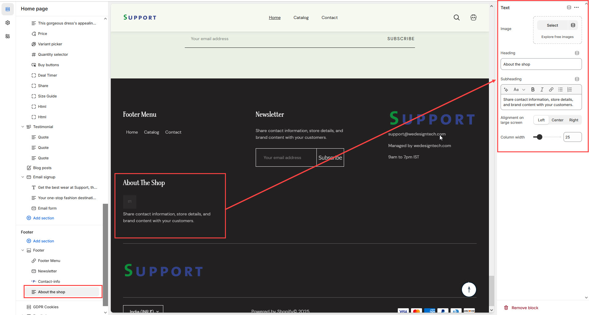

# Text

The **Text Block** in the Footer Section allows you to add **custom text, images, and store details**, making it ideal for sharing **contact information, brand messages, or store policies**.


* **Go to** Shopify Admin > **Online Store > Themes**.
* Click **Customize** on your active theme.
* Navigate to **Footer Section > Add Block > Text**.
* Configure the settings as needed.


* **Image:** Add a logo or relevant brand image.
* **Heading:** Set a title for the text block.
* **Subtext:** Add additional details (**e.g., "Share contact information, store details, and brand content with your customers."**).
* **Alignment on Large Screens:** Adjust the position of the text block for desktop view **(Left,Right,Center).**

<figure><figcaption></figcaption></figure>
