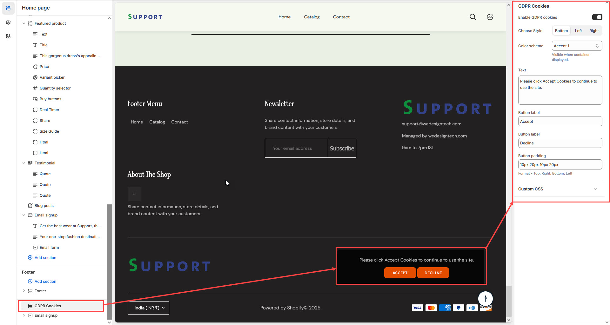

# GRDR Cookies

The **GDPR Cookies Block** in the Footer Section allows you to display a **cookie consent banner**, ensuring compliance with **General Data Protection Regulation (GDPR)** laws by informing visitors about cookie usage on your store.


* **Go to** Shopify Admin > **Online Store > Themes**.
* Click **Customize** on your active theme.
* Navigate to **Footer Section  > GDPR Cookies**.
* Configure the settings as needed.


* **Enable GDPR Cookies:** Displays a cookie consent banner on your store.
* Customize the appearance of the **GDPR banner**  by aligning **(Left,Right,Bottom)**.
* **Color scheme :** You can customize the section’s appearance by changing the **text color, background color**, and more using preset color options
* **Customizable Message:** Modify the consent message (**e.g., "Please click Accept Cookies to continue to use the site."**).
* **Button Label:** Customize the text on the consent button (**e.g., "Accept Cookies"**).
* **Button Padding:** Adjust padding using the format: **Top, Right, Bottom, Left**.

<figure><figcaption></figcaption></figure>
