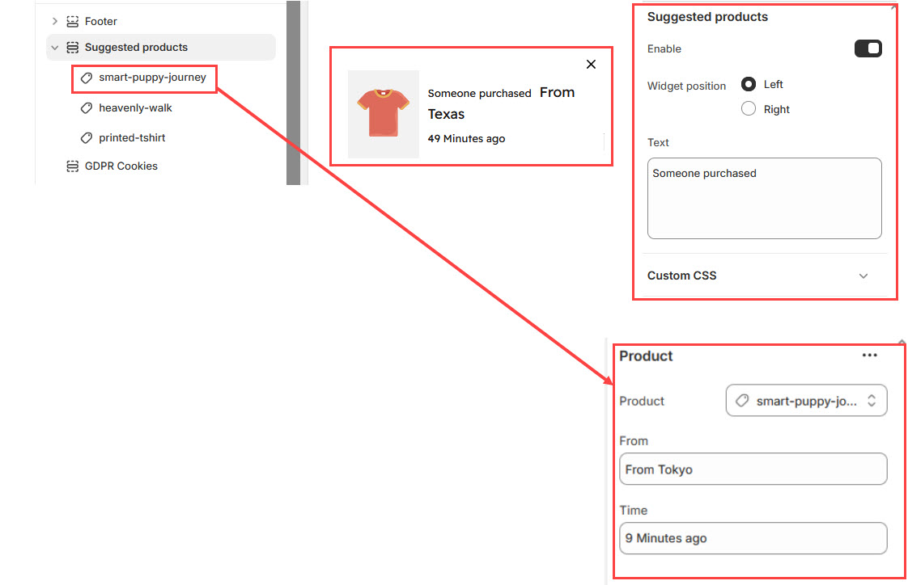

# Suggestion Product

The **Suggested Products Block** in the Footer Section allows you to display a **widget showcasing recently purchased or recommended products**, improving **cross-selling and customer engagement**.


* **Go to** Shopify Admin > **Online Store > Themes**.
* Click **Customize** on your active theme.
* Navigate to **Footer Section > Suggested Products**.
* Configure the settings as needed.


* **Enable :** Toggle to activate or deactivate the suggestion product.
* **Widget position Left:** Aligns the products to the left side of the bottom on the theme.
* **Widget position Right:** Aligns the products to the right side of the bottom on the theme.
* **Customization Message:** Modify the default text (**e.g., "Someone purchased"**) to create urgency and engagement.

### **Adding block to Suggested Products**&#x20;


* **Click Add Product** under the Suggested Products section.
* **Form:** To determine the place of buying.
* **Time:** Show the time of the latest purchase.


<figure><figcaption></figcaption></figure>
