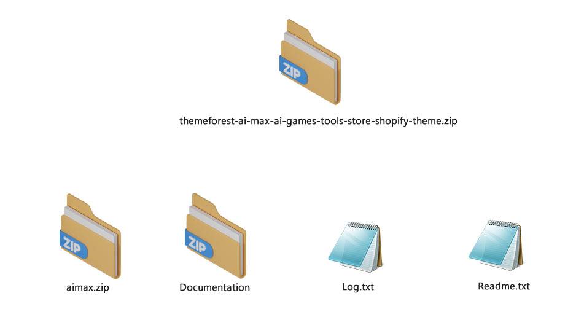

# Missing template "layout/theme.liquid"

* When I upload the zip file to Shopify I get an error saying "zip does not contain a valid theme: **missing template "layout/theme.liquid"**.
* The package you received from **Themeforest** has the following items: file, documentation, log.txt, readme
* Please Extract the whole package after downloading it from Themeforest. **themeforest-ai-max-shopify-theme**,
* You files like Documentation, **ai-max.zip** , Log.txt and Readme.txt.
* You need to install the file **"ai-max.zip" in the shopify store**&#x20;

<figure><figcaption></figcaption></figure>
