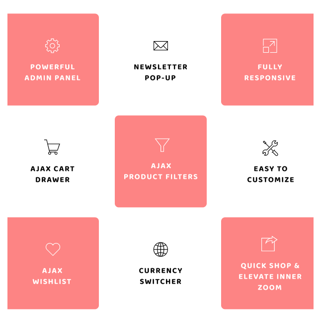

# Theme features

The _**concept**_ is fully compatible with _**Shopify Template 2.0 (Section on every page)**_ with tons of features. It allows you to create different structures and could meet any specific requirements:

* **Framework:** Fully Compatible with Shopify OS 2.0
* **Page Layouts:** Multiple Page Layouts
* **Sections:** 35+ Unique Sections
* **Headers:** Multiple Headers
* **Responsive design:** Looks great on desktops, laptops, tablets and mobiles. Give it a try on your iPhone or iPad now.
* **Draggable sections:** Option to change the home page layout order using drag and drop option.
* **Custom Content Block** Option to showcase custom content with images.
* **Ajax filters:** Filter products by colors and other parameters using tags.
* **Ajax Cart:** An option to purchase the items without leaving the current page.
* **Ajax Wishlist:** An option to keep your items in the wishlist.
* **Highly customizable:** Change colors, fonts, background image through the theme settings. No coding required.
* **Multi-currency:** The currencies AUD,CAD,USD,GBP,JPY,EUR,NZD,INR,PHP are inbuilt with theme
* **Product sorting on collection pages:** Sort by price, A to Z, newest etc.
* **Great for SEO:** Uses the latest Shopify SEO features and product data is formatted for Google rich snippets, so that product listings are optimized for search engines.
* **Deal Timer:** An option to set up a deal timer to promo banners as well as for unique products.
* **Newsletter:** A pop-up and standard newsletter subscription form.
* **Social sharing:** Share by X (Twitter), Facebook, Instagram and Pinterest.

<figure><figcaption></figcaption></figure>
