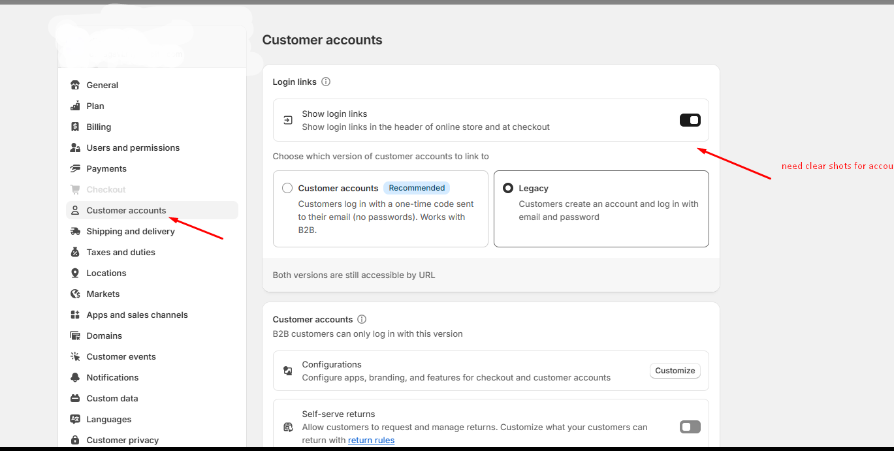
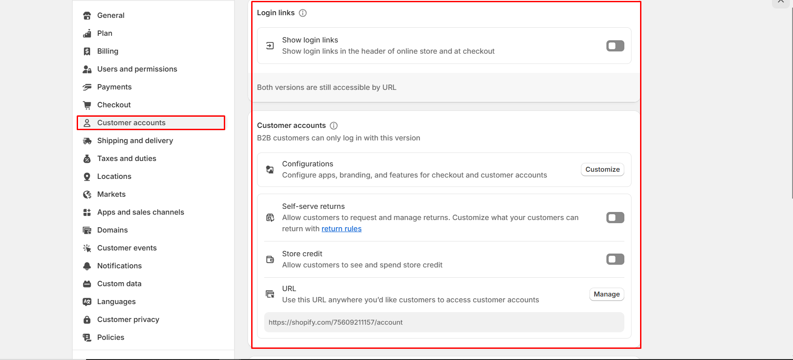

# Account Page

The **Account Page** in Shopify is where customers can log in, view their order history, manage their addresses, and update account details.

### How to Enable the Customer Account Page:

* **Log in** to your Shopify admin panel.
* Go to dashboard panel **Settings > Customer accounts.**
* Enable **Show login links**
* Click **Save** to apply changes.
* Customers can log in via the **"Sign in"** or **"Account"** link in your store’s navigation and access the account page.

<figure><figcaption></figcaption></figure>

<figure><figcaption></figcaption></figure>
