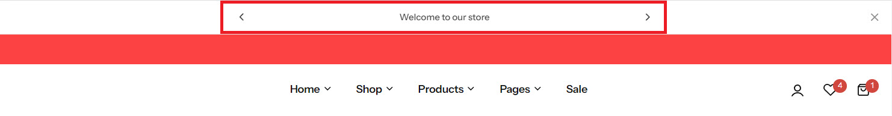
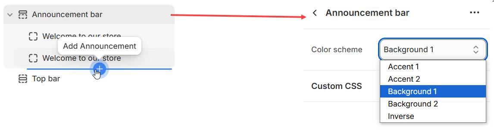

# Announcement bar

The **Announcement Bar** is a feature in Shopify that allows you to display important messages or promotions at the top of your store. This is a great way to catch your customers' attention with updates, offers, or news.

<figure><figcaption>
Announcement bar
</figcaption></figure>


1. Go to **Shopify Admin > Online Store > Themes.**
2. In **Customize** on your active theme.
3. **Click Announcement Bar.**


**Color scheme :** You can customize the section’s appearance by changing the **text color, background color**, and more using preset color options to the announcement bar.


**Adding Block :** Announcement Bar >  **Click Add Announcement.** Without adding block to Announcement bar it will not be visible


&#x20;**Announcement Block:** Add the respective Text and Link to the Announcement Block and click **save**.

<figure><figcaption></figcaption></figure>

<figure><figcaption></figcaption></figure>
