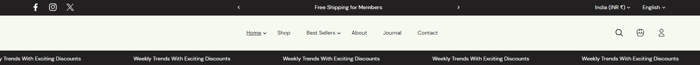
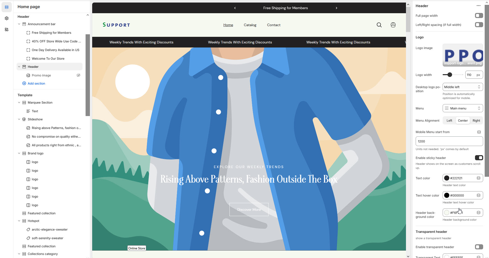
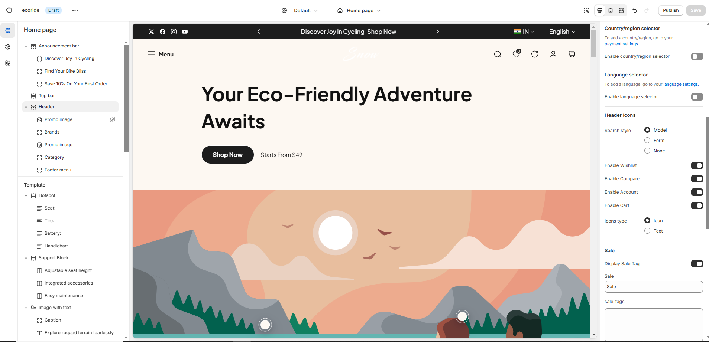

# Header

The **Header Section** in Shopify is one of the most important areas of your store, as it appears at the top of every page. It typically includes your store's logo, navigation menu, search bar, and sometimes a shopping cart icon or additional links

<figure><figcaption></figcaption></figure>


* **Go to** Shopify Admin > **Online Store > Themes**.
* Click **Customize** on your active theme.
* In the Theme Editor, navigate to **Header Section**.


* **Show Full Width:** Expands the section across the entire screen width.
* **Right & Left Spacing :** Add **spacing** to the **Full Width** layout (applies  in full-width mode).
* **Upload Logo Image:** Customize your store’s branding.
* **Custom Logo Width:** Adjust the logo size.
* **Desktop Logo Position:** Set logo position (**Middle, Middle Left,Top Left, Top Center**).


Position is automatically optimized for mobile.


* **Menu Alignment:** Align the main navigation menu.**(Left,Right,Center)**
* **Menu:** Select the store’s primary navigation menu&#x20;
* **Mobile Menu Start From:** Define the breakpoint for mobile menu display.
* **Enable  Sticky Header:** Keeps the header visible when scrolling when enabled.
* **Enable transparent Header:** Makes the header transparent on enabling.

<figure><figcaption></figcaption></figure>

* &#x20;**Enable country/region** [**selector**](https://wedesignthemes.gitbook.io/ai-max-ai-games/~/changes/270/header-group/selectors)**:** Allows users to change regions (**Set in Market Settings**).
* **Enable language** [**selector**](https://wedesignthemes.gitbook.io/ai-max-ai-games/~/changes/270/header-group/selectors)**:** Enables multiple language options (**Configured in Language Settings**).
* **Enable  Search:** Adds a **search** icon can customizer it in **(Theme setting >** [**search behavior**](https://wedesignthemes.gitbook.io/ai-max-ai-games/~/changes/270/theme-settings/search-behaviour)**).**
* **Enable  Wishlist:** Allows customers to save favorite products.
* **Enable Compare:** Adds a comparison feature for products.
* **Enable  Account:** Displays an account login icon **(**[**should also enable in dashboard settings**](https://wedesignthemes.gitbook.io/ai-max-ai-games/~/changes/270/header-group/account-page)**)**.
* **Enable Cart:** Shows the shopping cart icon on enabling.
* **Enable  Category Menu:** Enable the category menu and  works only when the logo is positioned (**Top Left or Top Center**.)
* **Category Heading:** Set a title for the category menu.
* **Category Menu:** Select a menu for categories.
* **Spacing:**&#x41;llow to add margin at bottom
* **Display Sale Tag:** Show a sale label for selected menu items.
* **Sale:** Add the tag name as required to the theme
* **Map Sale Tag with Menus:** Enter **menu names** separated by commas.
* **Display New Tag:** Show a new label for selected menu items.
* **New:** Add the tag name as required to the theme
* **Map New Tag with Menus:** Assign **menus for new arrivals**.
* **Display Hot Tag:** Show a hot label for selected menu items.
* **Hot:** Add the tag name as required to the theme
* **Map Hot Tag with Menus:** Assign menus for hot-selling items.


**Note:** A tag will be displayed in the top header navigation to highlight the product's special offers.


<figure><figcaption></figcaption></figure>
