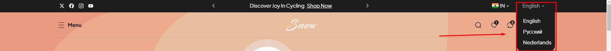

# Selectors (Language & Currency)

### Currency Selector

Shopify now allows stores to allow customers to shop and check out in their local currency. This is a very positive thing because buyers are much more likely to have a good experience shopping in their own currency and finalize their purchase knowing that they will not incur any additional fees from their bank.

<figure><figcaption></figcaption></figure>


&#x20;After enabling the currency selectors follow these steps **(should be enabled on** [**Header**](header.md) **or in** [**Topbar** ](top-bar.md)**as per requirement)**


* Set up your store’s Markets under **Settings > Markets**. This defines the regions that you sell to (you would have had to do this already to set up international shipping rates).
* Activate local currencies. Go to **Settings > Markets > International** (or other Market) **> Make active.**&#x54;his will turn on the multi-currency shopping experience for the selected market. Ensure that your regions in payment settings match your shipping zones.
* Show the currency selector.

<figure><figcaption></figcaption></figure>

### Language selector


&#x20;After enabling the Language selectors follow these steps **(should be enabled on** [**header** ](header.md)**or in** [**topbar** ](top-bar.md)**as per requirement)**


<figure><figcaption></figcaption></figure>

* Open **Admin store settings > Languages > Install translate & adapt app ( Shopify Translate & Adapt).**
* Click **Add language > select language > add.** Then publish the **Selected language > Translate** option in the selected language
* Click on the app which appears on the **Translate button > click auto-translate.**
* &#x20;Wait for a few more minutes. Let the translation be completed.
* &#x20;Check with the theme by switching to **Another language.**

<figure><figcaption></figcaption></figure>

<figure><figcaption></figcaption></figure>
