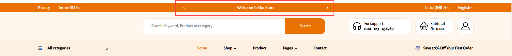
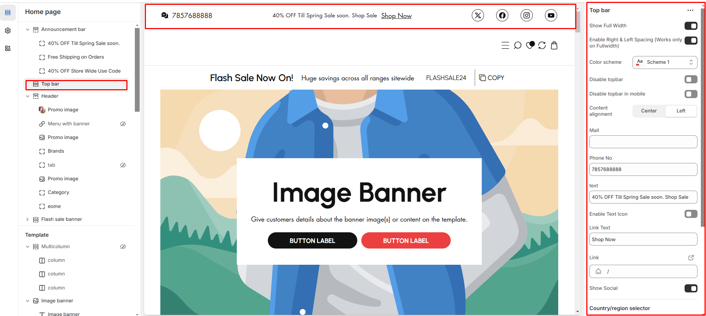

# Top bar

A **Top bar**, similar to an announcement bar, displays key information such as the website's contact address and other essential details. While both elements are positioned at the top of a web page.

<figure><figcaption>
Top Bar
</figcaption></figure>


1. Go to **Shopify Admin > Online Store > Themes.**
2. In **Customize** on your active theme.
3. **Click Top Bar.**


* **Show Full Width:** Expands the section across the entire screen width.
* **Right & Left Spacing :** Add **spacing** to the **Full Width** layout (applies  in full-width mode).
* **Disable Top Bar :** Option to show or hide the top bar.
* **Disable Top Bar in Mobile:** Hides the top bar only on mobile devices.
* **Color scheme :** You can customize the section’s appearance by changing the **text color, background color**, and more using preset color options.
* **Mail:** Display a contact email.
* **Phone No.:** Show your store’s phone number.
* **Text:** Add a custom message or announcement to topbar.
* **Enable Text Icon:** Display an icon next to the text.
* **Link Text :** Add a Text to the topbar
* **Link:** Link the given text &#x20;
* **Show Social:** Display linked social media icons  (configured in **Theme Settings**)..

### [Selector](https://wedesignthemes.gitbook.io/ai-max-ai-games/~/changes/270/header-group/selectors) 

* **Country/Region Selector:** Allows users to switch their country/region (Configured in **Payment Settings**).Enable the toggle to show on the topbar
* **Language Selector:** Allows users to change the store’s language (Configured in **Language Settings**).Enable the toggle to show on the topbar

<figure><figcaption></figcaption></figure>
