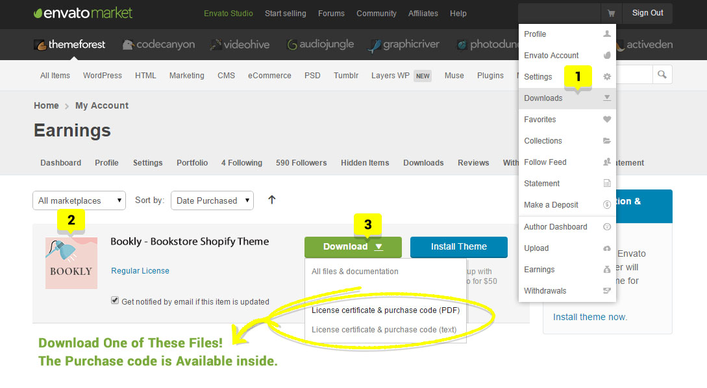

# Download the Theme Package

When you purchase our theme from ThemeForest, you can download the theme files via the **‘Downloads’** tab on your ThemeForest account. While you download theme, you can choose the ‘**All Files & Documentation’.** This will includes the theme files and supporting documents.


**Step 1** –  Sign in to your [ThemeForest](http://themeforest.net/)account and go to the **'Downloads'** tab.

**Step 2** – Locate your Theme purchase, and click the Download button. Choose between **‘All Files & Documentation’.**


<figure><figcaption></figcaption></figure>
