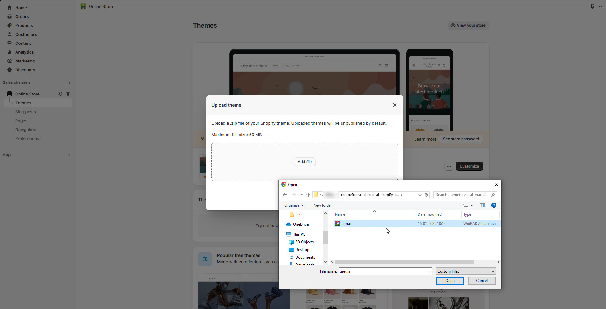
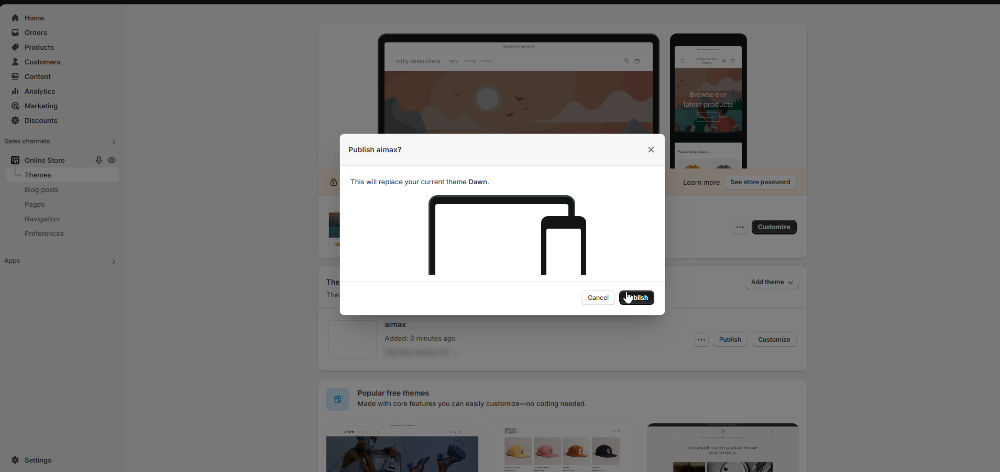

# Theme Installation


Before installing the theme, please unzip "**bookly-shopify-theme.zip**"and  upload the "**bookly.zip**" file to Shopify to avoid the ["layout/theme.liquid" missing template](https://blueskytechco.gitbook.io/glozin-shopify/frequently-asked-questions/missing-template-layout-theme.liquid) error.


## **Theme** Extractions 


1. Download the package from  [Themeforest.net](https://themeforest.net/) (it will be in ZIP format).
2. Find the file **"themeforest-xxxxxx-bookly-shopify-theme.zip"** in your folder.
3. Extract the contents of the **ZIP** package you just downloaded.
4. Upload the **bookly.zip** file to your Shopify store.


📂 **themeforest-xxxxxx-bookly-shopify-theme.zip**

<figure><figcaption></figcaption></figure>

### Upload Theme Through Shopify Admin Panel

<figure><figcaption></figcaption></figure>


1. **Log in** to the Shopify Panel.
2. Click **"Online Store"** from the left-hand menu.
3. Click **"Add theme" > "Upload zip file."**
4. Select and upload the **bookly.zip** file. The theme will then be uploaded to your store.
5. Once the upload is complete, click **"Actions"** > **"Publish."**


<figure><figcaption></figcaption></figure>

<figure><figcaption></figcaption></figure>

### [How to install Shopify theme ](https://youtu.be/1nKm4hy-EnQ)


