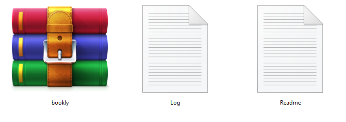

# ThemeForest - Theme Files

Below is a full list of everything that is included when you download the main files, along with a brief description of each item.

Please unpack the whole package after downloading it from Themeforest. On that extracted **themeforest-xxxxxx-bookly-shopify-theme.zip**, You can find files like Documentation, bookly.zip , Log.txt and Readme.txt. You need to install the file **"bookly.zip"**.

* **bookly.zip** – This is the installable theme file you’ll need to install or upload.
* **Log.txt** – This file contains theme change/update log.
* **Readme.txt** – This file contains details about the folder structure and a link to the documentation.

📂 **themeforest-lNHYQKIB-bookly-shopify-theme.zip**

<figure><figcaption></figcaption></figure>
