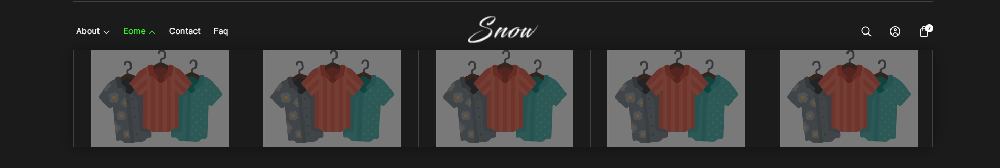
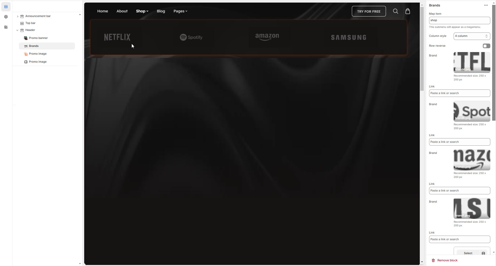

# Mega menu with Brands

The **Brands Section** in the header allows you to showcase multiple **brand logos** within a **megamenu**, improving brand visibility and enhancing navigation.

<figure><figcaption></figcaption></figure>


* **Go to** Shopify Admin > **Online Store > Themes**.
* Click **Customize** on your active theme.
* Navigate to **Header Section > Add block > Add Brands**.
* Configure the settings as needed.


* **Map Item:**  Add the [navigation menu](../header-group/navigation-menu.md) name to map items to brands
* **Column Style:** You can select the column layout based on the theme requirements. Available options include (**3, 4, 5, 6, and 1:1:2 columns.)**


Each brand block consists of an **image and link** add as require to the theme.


* **Image:** Upload image to the brand
* **Link:** Paste a URL or search for an internal page.
* **(**[**Ref : Mega menu creation-video)**](mega-menu-creation-video.md)

<figure><figcaption></figcaption></figure>

