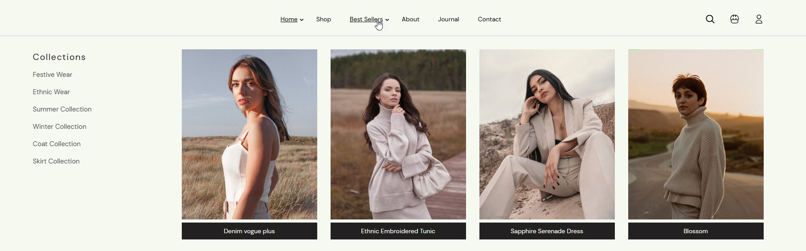
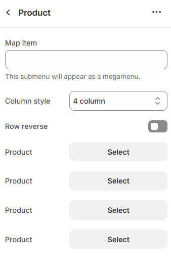

# Mega menu with Product

The **Product Section** in the header allows you to showcase specific **products within a megamenu**, making it easier for customers to access featured or best-selling items directly from the navigation.

<figure><figcaption></figcaption></figure>


* **Go to** Shopify Admin > **Online Store > Themes**.
* Click **Customize** on your active theme.
* Navigate to **Header Section > Add block > Add Product**.
* Configure the settings as needed.


* **Map Item:**  Add the [navigation menu](../header-group/navigation-menu.md) name to map items to product.
* **Column Style:** You can select the column layout based on the theme requirements. Available options include (**3, 4, 5, 6, and 1:1:2 columns.)**
* Select a product to display from your store.


Each column can display a **single product**, allowing up to **4 featured products** in the megamenu.


* **(**[**Ref : Mega menu creation-video)**](mega-menu-creation-video.md)

<figure><figcaption></figcaption></figure>
