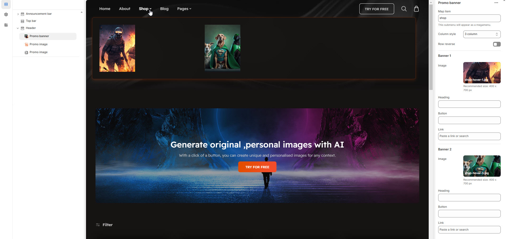

# Mega menu with Promo Banner

The **Promo Banner** feature allows you to display **promotional banners** within a **megamenu**, enhancing navigation with visual content such as **special offers, featured products, or announcements**.


* **Go to** Shopify Admin > **Online Store > Themes**.
* Click **Customize** on your active theme.
* Navigate to **Header Section >Add block > Add Promo Banner**.
* Configure the settings as needed.


<figure><figcaption></figcaption></figure>

* **Map Item:**  Add the [navigation menu](../header-group/navigation-menu.md) name to map item to promo banner&#x20;
* **Column Style:** You can select the column layout based on the theme requirements. Available options include (**3, 4, 5, 6, and 1:1:2 columns.)**
* **Row Reverse:** Enable to **swap the row order** of banners and text in promo banner of the megamenu.


Each column can include an image, heading, button, and link add as require to the theme.


* &#x20;**Image** :Upload the image to the banner
* **Heading:** Add a title.
* **Button:** Customize button text.
* **Link:** Add a destination URL.
* **(**[**Ref : Mega menu creation-video)**](mega-menu-creation-video.md)

<figure><figcaption></figcaption></figure>
