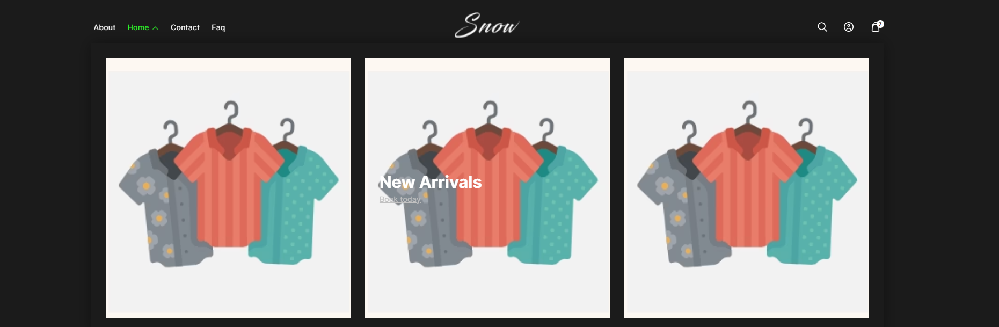
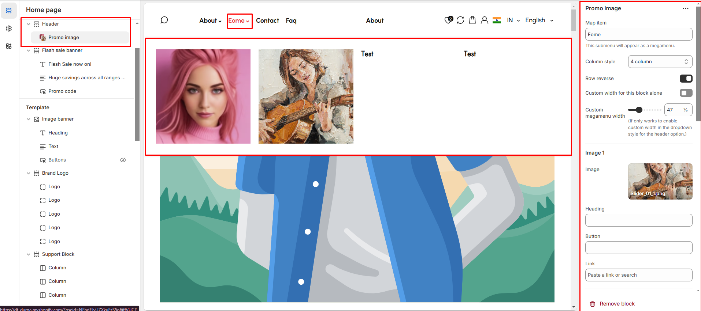

# Mega menu with Promo Image

The **Promo Image** feature allows you to display promotional images within a **megamenu**, enhancing navigation with visual content such as **offers, banners, or featured products**.


* **Go to** Shopify Admin > **Online Store > Themes**.
* Click **Customize** on your active theme.
* Navigate to **Header Section >Add block > Add Promo Image**.
* Configure the settings as needed.


<figure><figcaption></figcaption></figure>

* **Map Item:** Add the [navigation menu](../header-group/navigation-menu.md) name to map item to promo image
* **Column Style:** You can select the column layout based on the theme requirements. Available options include (**3, 4, 5, 6, and 1:1:2 columns.)**
* **Row Reverse:** Enable to **swap the row order** of images and text in promo image megamenu.


Each column include an image, heading, button, and link add as require to the theme.


* **Image:**&#x55;pload the image to the promo image &#x20;
* **Heading:** Add a title.
* **Button:** Customize button text.
* **Link:** Add a destination URL.\
  &#xNAN;**(**[**Ref : Mega menu creation-video)**](mega-menu-creation-video.md)

<figure><figcaption></figcaption></figure>
