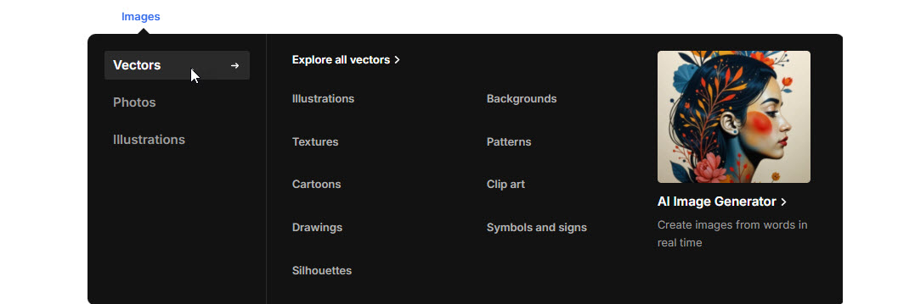

# Mega menu with Tab Menu

The **Tab Menu Section** allows you to create a **megamenu with multiple tabs**, each containing **menus, banners, and product categories**, providing a structured and visually engaging navigation experience.

<figure><figcaption></figcaption></figure>


* **Go to** Shopify Admin > **Online Store > Themes**.
* Click **Customize** on your active theme.
* Navigate to **Header Section > Add block >  Add Tab Menu**.
* Configure the settings as needed.


* **Map Item:**  Add the [navigation menu](../header-group/navigation-menu.md) name to map items to Tab menu.
* **Row Reverse:** Enable to **swap the row order** of content in tab menu .
* **Tab Menu Style:** Select the preferred tab display style **(Horizontal,Vertical).**


Each tab includes a **heading, menu selection, column style and Banner**.


* **Tab Heading:** Enter the title for the tab.
* **Select Menu:** Choose a Shopify menu to display under the tab.
* **Column Style:** You can select the column layout based on the theme requirements. Available options include (**3, 4, 5, 6, and 1:1:2 columns.)**
* **Row Reverse:** Adjust the order of text and images.
* **Banner:** Upload an image to visually represent the tab.
* **(**[**Ref : Mega menu creation-video)**](mega-menu-creation-video.md)

<figure><figcaption></figcaption></figure>
