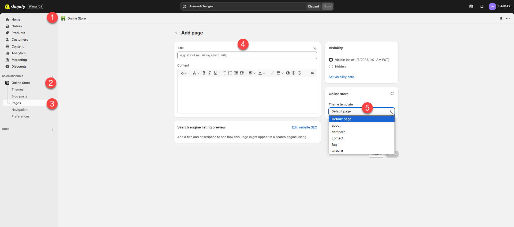

# About Us

In a **Shopify theme**, the **About Us** page is a customizable section where you can share details about your brand, story, and values. It helps build trust and engagement with customers.

### How to create About page


**Step 1 :** Go to **Online Store > Pages.**

**Step 2 :** Click the **Add page**. It navigates to another page

**Step 3 :** Enter the page **Title**.(eg: about)

**Step 4 :** Select the **About** template from the **Theme template** drop-down menu in the **Online Store** sectio&#x6E;**.**

**Step 5 :**  Add content, media, etc. in the **Customizer**

**Step 6 :** **Save** the changes


<figure><figcaption></figcaption></figure>

### Page Creation


