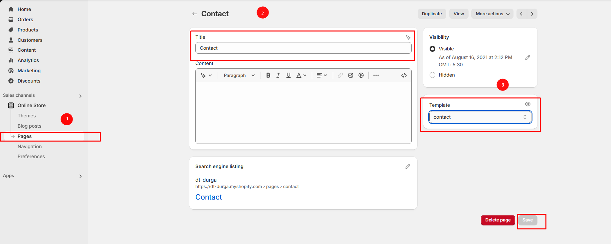
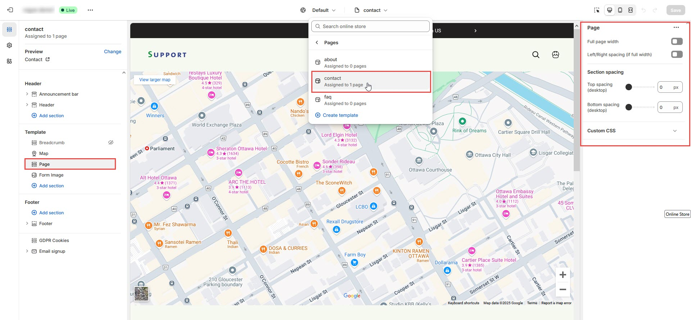

# Contact

In a **Shopify theme**, the **Contact Us** page is a built-in or customizable section that allows customers to reach out to the store owner for enquiries, support, or business-related questions.

### How to create Contact page


**Step 1 :** Go to Online Store > Pages.

**Step 2 :** Click the **Add page**. It navigates to another page

**Step 3 :** Enter the page **Title**.(Eg: Contact)

**Step 4 :** Select the **Contact** template from the **Theme template** drop-down menu in the **Online Store** sectio&#x6E;**.**

**Step 5 :** Add content, media, etc. in the **Customizer**&#x20;

**Step 6 :** **Save** the changes.


<figure><figcaption></figcaption></figure>

### Contact Page Customization


**Step 1 :** Go to **Online Store > Themes > Customize**

**Step 2 :** Select the **Contact** page in the **Customizer > Add Section > Form Image , Contact Form or Contact section**_**.**_

**Step 3 :** Select a form image section from the left side to enter the details

**Step 4 :** Enter the required details for the section in the right sidebar.

**Step 5 :** Provide the image, Heading, and Description&#x20;

**Step 6 :** Enter the essential factors for the contact page, such as the Address, Phone number, Email, etc.

**Step 7 :** Set the section padding.Allow to add spacing in top and bottom

**Step 8 :** Then add your custom class name if needed.

**Step 9 : Save** the process

**Step 10 :** Click the preview in right side to see the changed made.


<figure><figcaption></figcaption></figure>

### [Page Creation](https://help.shopify.com/en/manual/online-store/themes/customizing-themes/add-contact-page)


