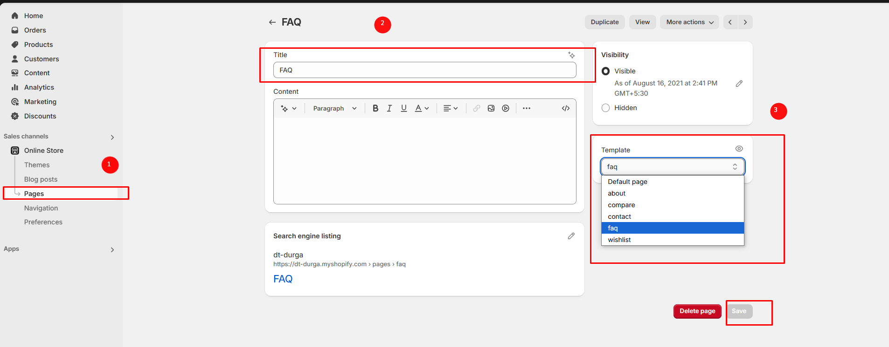
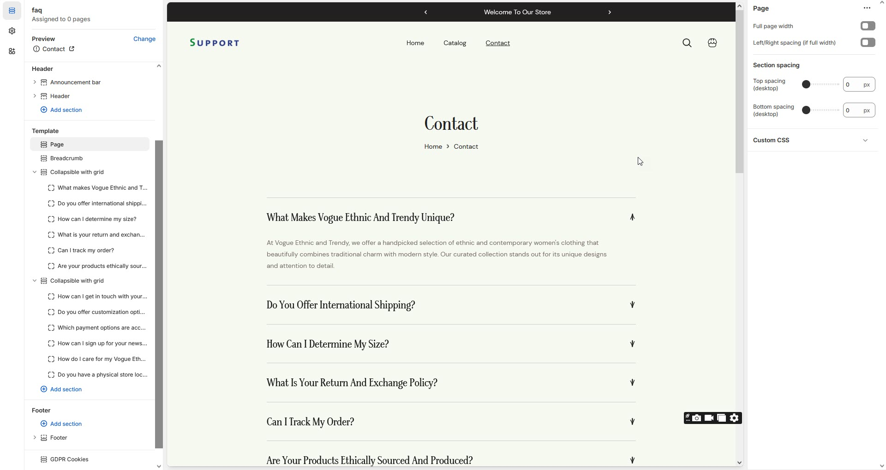

# FAQ page

The **FAQ page** addresses common questions to help users find answers quickly and improve their experience on the website.

### How to create faq page


**Step 1:** Go to **Online Store > Pages.**

**Step 2:** Click the **Add page**, it navigates to another page.

**Step 3:** Enter the required **Title** for the page.

**Step 4:** Select **FAQ** from the **Theme template** drop-down menu in the **Online Store** sectio&#x6E;**.**

**Step 5:** Add content, media, etc. in the **customizer.**

**Step 6: Save** the changes.&#x20;


<figure><figcaption></figcaption></figure>

### Customization of FAQ


To add questions and answers to the **FAQ**, follow the steps below.

**Step 1 :** Go to **Online Store > Themes > Customize**&#x20;

**Step 2 :** On the left sidebar, you can add sections for the faq.

**Step 3 :** Select the FAQ page from the **Customizer > Add Section > Faq or Collapsible Content**

**Step 4 :** Select a **Collapsible row** to add **Question ,Answer and subheading with icons.**

**Step 5 :** On the right sidebar, you can give the questions,answers,subheading and icon for faq.

Heading as Question and Row content as Answer for the Question.

**Step 6 :** **Save** the process.


<figure><figcaption></figcaption></figure>
