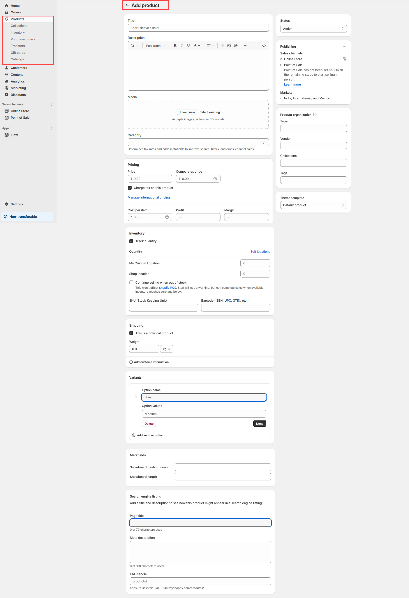
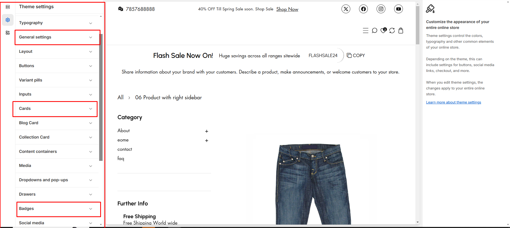

# Creating Products

Creating a **Product Page** in Shopify allows you to add and manage products, set pricing, track inventory, and customize display settings for better customer engagement.


* **Go to** Shopify Dashboard > **Products**.&#x20;
* Click **Add Product**.
* Enter the **Product Title, Description, and Price**.
* Upload **High-quality images** of your product.
* Set up **Inventory & Shipping details** (if applicable).
* Click **Save**.


<figure><figcaption></figcaption></figure>


The collection should be created before adding a product so it can be assigned to the appropriate group.


* **Status:**&#x41;ctive to make the product visible or can add draft to make it invisible&#x20;
* **Title:** Enter the product name.
* **Description:** Provide key details, features, and benefits.
* **Media:** Upload images, videos, or 3D models for visual appeal.
* **Price:** Enter the selling price in the price text box.
* **Compare-at Price:** Add a higher or original price to display discounts.
* **Cost per Item:** Enter the product's manufacturing cost.
* **Profit & Margin:** This is the actual amount of money a business makes from selling a product,Margin is the percentage that represents the profitability of the product in relation to its selling price.
* **Track Quantity:** The checkbox available to track the quantity of the product
* **Shop location:**&#x49;n Shopify, the **shop location** on a product detail page refers to the physical location or warehouse from where a product is being fulfilled or shipped.
* **Continue selling when out of stock:**&#x45;nable the checkbox this won't affect [Shopify POS](https://help.shopify.com/en/manual/sell-in-person/shopify-pos/inventory-management/setup-inventory-tracking-pos). Staff will see a warning, but can complete sales when available inventory reaches zero and below.
* **This product has a SKU or barcode:** Enable the checkbox to add a unique code assigned to each product or product variant.(**Stock Keeping Unit**,)
* **This is a physical product:** Enable the checkbox to add **weight** to the product
* Can create and add [**metafield** ](metafield.md)to the product if required

### Product organization

* **Type:**&#x41;llow to add the type of the product have option to enable and disable in product detail page
* **Vendor:**&#x54;he vendor name is a way for customers to identify the brand or the supplier of the product.
* **Collections:** Collections help organize products and improve navigation for customers.
* **Tags:** In Shopify, **product tags** help organize and filter products.

### [Variants](https://wedesignthemes.gitbook.io/ai-max-ai-games/~/changes/270/product/product-variants)

Variants allow customers to choose between different configurations of the same product without creating separate product listings

* **Example Variants:**&#x49;f you sell a **T-shirt**, you might have these variants
* **Size**: Small, Medium, Large
* **Color**: Red, Blue, Black
* Click **Save**

<figure><figcaption></figcaption></figure>

### &#x20;**Product Customization in customizer**

* **Card :** Modify product card via **Customizer > Theme Settings >** [**Cards**](https://wedesignthemes.gitbook.io/ai-max-ai-games/~/changes/270/theme-settings/cards).
* **Badge Customization:** Adjust badge via **Customizer > Theme Settings >** [**Badge**](https://wedesignthemes.gitbook.io/ai-max-ai-games/~/changes/270/theme-settings/badges).
* **General settings:**&#x41;llow the product to customize the icons and another options via **Customizer > Theme Settings >** [**General settings**](https://wedesignthemes.gitbook.io/ai-max-ai-games/~/changes/270/theme-settings/general-settings)
