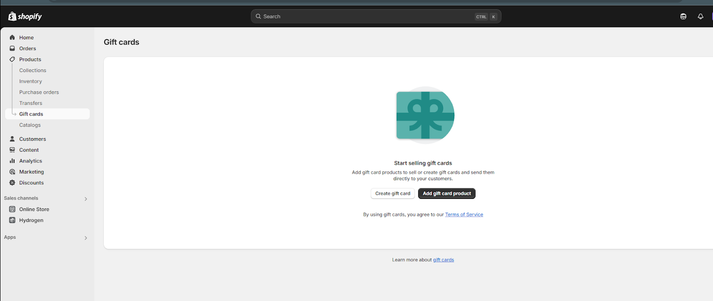
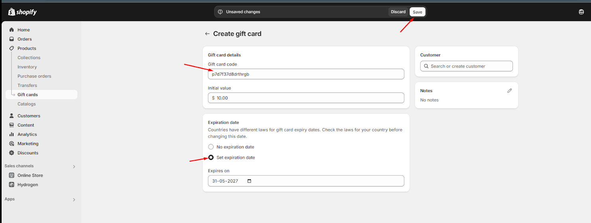
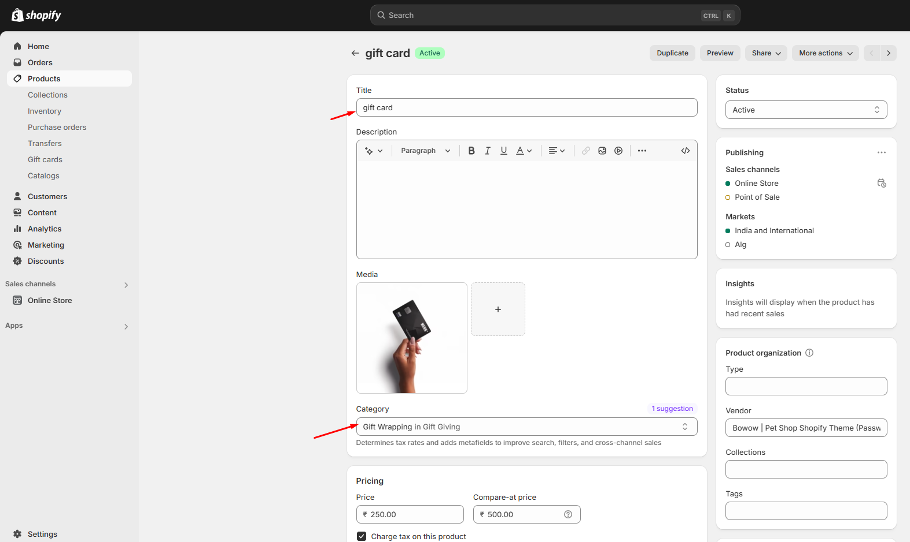
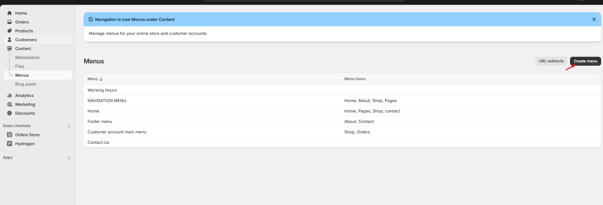
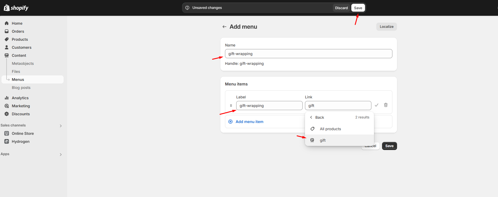
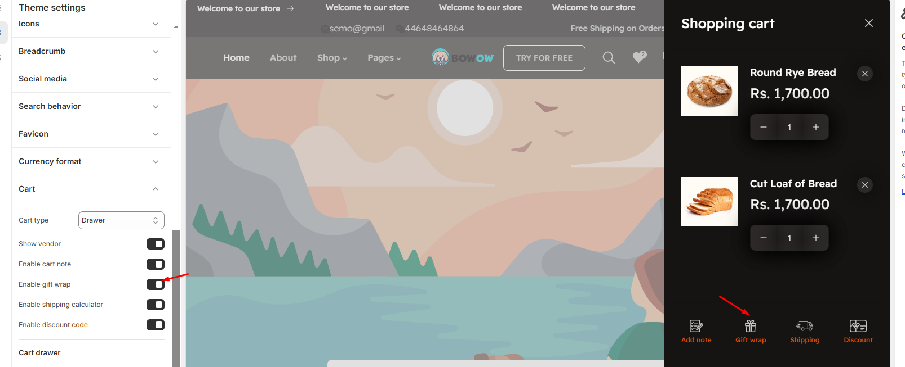
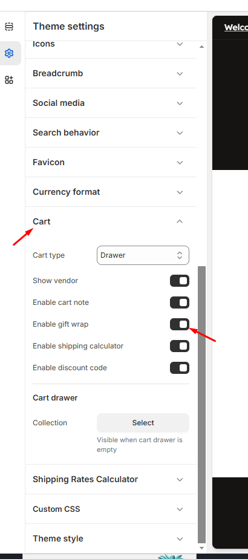

# Gift Cards

### Step 1: Create a New Gift Card

* Go to **Shopify Admin > Products > Gift Cards.**
* Click **Create gift card.**
* **(Optional)** Change the Gift card code if needed.
* Click **Save.**

<figure><figcaption></figcaption></figure>

<figure><figcaption></figcaption></figure>

### Step 2: Create a Gift-Wrap Product

* Go to **Shopify Admin > Products > Add product (link)**
* Create a **Gift-wrap product.**
* Enter product details **(title, description, price, and gift image if necessary).**
* Click **Save.**

<figure><figcaption></figcaption></figure>

### Step 3: Create a Menu for Gift Wrapping

* Go to **Shopify Admin > Online store > Navigation > Create menu.**
* Name the menu gift-wrapping (this ensures the handle assigned is gift-wrapping).
* Add the gift-wrap product to the menu:
* Click **Add menu** item.
* Enter a Name for the link to the gift-wrap product.
* In the Link field, select Products, then choose the gift-wrap product from  the dropdown list then select that product.
* Click Save menu.

<figure><figcaption></figcaption></figure>

<figure><figcaption></figcaption></figure>

### Step 4: Enable Gift Card in Cart

* Go to **Shopify Admin > Online Store > Themes.**
* Click Customize to open the Theme Customizer.
* Navigate to **Theme Settings > Cart.**
* Enable gift wrap option to display it in the cart drawer.
* Click **Save.**

<figure><figcaption></figcaption></figure> <figure><figcaption></figcaption></figure>

