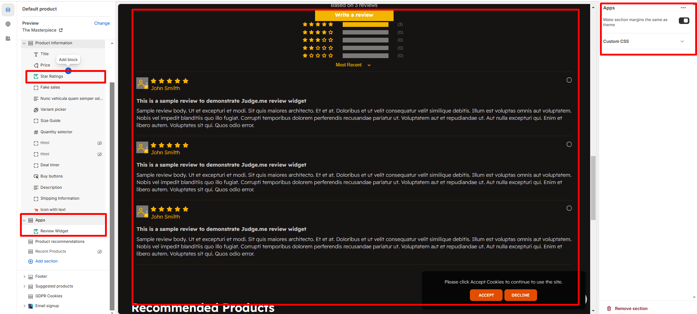
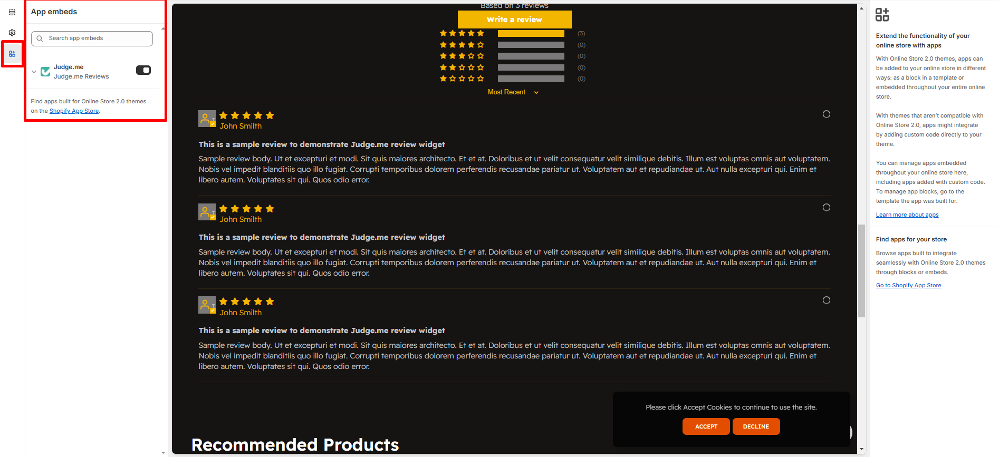

# Product review

Shopify doesn’t have built-in product reviews, but you can add them using Shopify apps or by customizing your theme.

* Go to **Shopify Admin > Apps**
* Search for **“Product Reviews”** by Shopify
* Click **Add app** and **install it**
* Follow the setup instructions to add the review section to your product pages [**(App Integration)**](broken-reference)


Kindly enable the Rating **( Featured collection ) ,** to display in product detail page kindly and app and  embed it&#x20;


<figure><figcaption></figcaption></figure>

<figure><figcaption></figcaption></figure>
