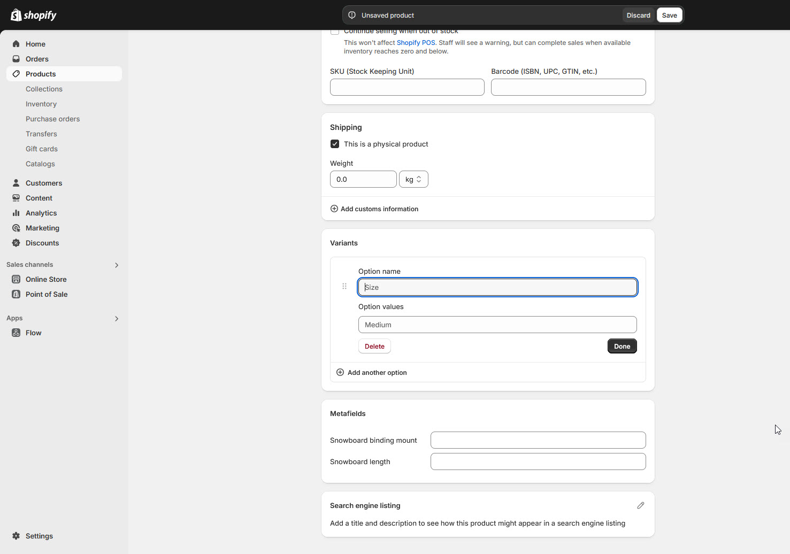
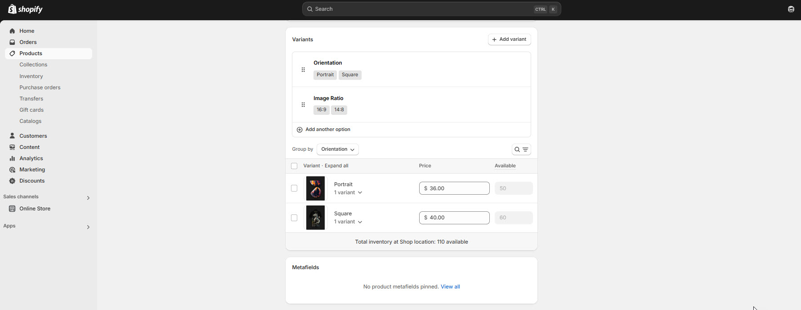

# Product Variants

In Shopify, a product variant is a version of a product that has specific attributes, such as size, color, material, etc. Variants allow you to sell a single product in multiple forms, helping customers choose the exact option they want.


**Note :** Variants are based on options, which are characteristics of the product (e.g., size, color). Each product can have up to 3 options (e.g., Size, Color, Material).


<figure><figcaption></figcaption></figure>

### How to add variant

* **Go to the dashboard Panel :** Navigate to **Products > Select your product.**
* **Enable Variants :** You can add variants by clicking the Plus symbol options available in the bottom of the product like variant you can also add another using **(add another option)**&#x20;
* For variant title you can add products variant like(Size ,colour, material or any think else that you need)&#x20;
* &#x20;**Add Options :** Define options like **Size or Color** and their values&#x20;
* For the variant list you may add in option values **(eg:S,XL,XXL,XXXL,M)(Blue, Black brown)**

<figure><figcaption></figcaption></figure>
