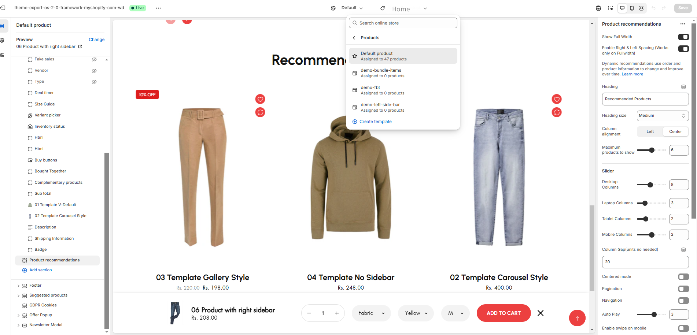

# Recommended Products

Recommended Products are suggestions displayed to customers based on their browsing or purchasing behaviour, product characteristics, or popular items.

### Why Use Recommended Products?

* **Increase Sales :** Encourages customers to explore and purchase more.
* **Cross-Selling and Upselling :** Suggest complementary or premium versions of products.
* **Personalization :** Improves the shopping experience by tailoring suggestions to the customer.
* **Discoverability :** Showcases products that customers may not have searched for directly.

### How to enable recommended Products?


* **Go to** Shopify Admin > **Online Store > Themes**.
* Click **Customize** on your active theme.
* Navigate to  **Products > Default product >** **Product Recommendations**. (available in top of the customizer **ref below screenshot**)&#x20;
* Configure the settings as needed.


<figure><figcaption></figcaption></figure>

* **Show Full Width:** Expands the section across the entire screen width.&#x20;
* **Right & Left Spacing :** Add **spacing** to the **Full Width** layout (applies  in full-width mode).
* **Heading:** Customize the section title (**Default: "Recommended Products"**).
* **Heading Size:** Choose from **Small, Medium, or Large**.
* **Maximum products to show:**&#x41;llow to show the total product to be display
* **Columns on desktop:** Allow to show the maximum number of products on desktop
* **Color scheme :** You can customize the section’s appearance by changing the **text color, background color**, and more using preset color options.
* **Image Ratio:**&#x41;llow to adjust the image height as **(Adapt image,Portrait and square)**
* **Show second image on hover:**&#x41;llow to show the another image on hover if added in the product&#x20;
* **Show Vendor:** Display the product vendor name.
* **Show product rating:** To display a rating, add a product rating ap&#x70;**.(**[**App integration**](https://wedesignthemes.gitbook.io/ai-max-ai-games/~/changes/270/app-integration/app-integration)**).**&#x54;he rating should also added to the product
* **Padding:** Top Padding and Bottom Padding are used to adjust the spacing above and below a section in Shopify, improving the layout and readability.
