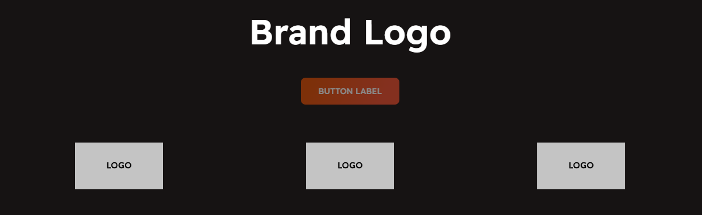
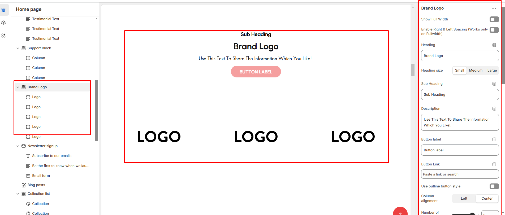
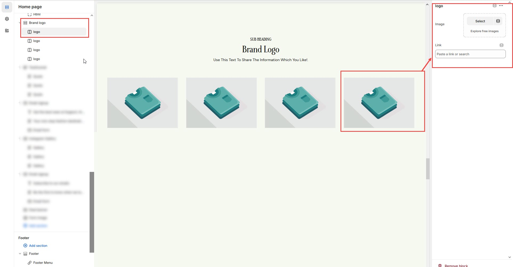

# Brand Logo

The **Brand Logo Section** allows you to display multiple brand logos in a grid or slider format, enhancing credibility and showcasing partner brands, sponsors, or featured collaborations.


* **Go to** Shopify Admin > **Online Store > Themes**.
* Click **Customize** on your active theme.
* In the Theme Editor, click **Add Section > Brand Logo**.


<figure><figcaption></figcaption></figure>

* **Show Full Width:** Expands the section across the entire screen width.&#x20;
* **Right & Left Spacing :** Add **spacing** to the **Full Width** layout (applies  in full-width mode).
* **Heading:** Set a custom title (e.g., "Hot & Top Trends").
* &#x20;**Heading Size:** Choose for size Small, Medium, or Large&#x20;
* **Subheading:** Add additional text if needed.&#x20;
* **Description :** Add a description (e.g., "Best arrivals this week").&#x20;
* **Button Label:** Add text (e.g., "Shop Now").&#x20;
* **Button Link:** Set the URL destination.&#x20;
* **Use Outline Button style:** Change the button to an outlined style.&#x20;
* **Column alignment:** Column can be aligned as per the content alignment requirement (Left,Center)
* **Number of columns on desktop:**&#x44;isplay the brand image per column.
* **Secondary background:**&#x41;llow to show the bakground or display none.
* **Block color setting:**&#x44;isplay color of the block
* **Color scheme :** You can customize the section’s appearance by changing the **text color, background color**, and more using preset color options.
* **Padding:** Top Padding and Bottom Padding are used to adjust the spacing above and below a section in Shopify, improving the layout and readability.
* [**Custom class:**](custom-class.md) The Shopify allows you to apply unique CSS styles to specific sections, blocks, or elements within your theme.
* **Swiper slider enable:** Enable the slider options
* **Slider option:** The range for displaying products can be adjusted based on the device type (Desktop, Tablet, and Mobile) to ensure a responsive layout.&#x20;
* **Swiper Pagination (Dots):** Show navigation dots for better user interaction.&#x20;
* **Swiper Navigation (Arrows):** Enable left/right navigation arrows.
* &#x20;**Auto Play :** Set the time delay between slides.&#x20;
* **Enable Swipe on  mobile:** Allow users to swipe through blocks on mobile devices.
* &#x20;**Enable Controls:** Display manual navigation options.
* &#x20;**Column on mobile:** Adjust based on mobile screen size can adjust to 1 column or 2 column..(works only the mobile swiper works)

<figure><figcaption></figcaption></figure>

### **Adding Brand Logos**


Without adding block to Brand logo the section seems to be empty


1. **Image:** Add a high-quality brand logo.
2. **Link:** Add a destination URL (optional) to direct users to the brand's page.

<figure><figcaption></figcaption></figure>
