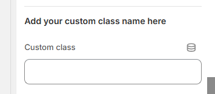

# Custom Class

A **custom class** in Shopify allows you to apply specific **CSS styles** to different sections, blocks, or elements within your theme. This helps in **customizing the appearance** of your store without modifying the default theme code.


Custom class is used to modify the designed style in a another word to make changes to already designed section modification

&#x20;**(For example1:** If adding 2 Section rich text and want to modify the design of the 2nd section design there works custom class **)**&#x20;

&#x20;**(For example2:** If there is common class in heading and need to add particular section heading alone capslock there can add custom class)&#x20;


### **Why Use Custom Classes in Shopify?**

* Allows **dynamic styling** without modifying the core theme
* &#x20;Makes **customization easier** via the Shopify Theme Editor
* &#x20;Helps in **mobile-friendly designs** and **unique layouts**
* With custom classes, you can **style specific sections** without altering the default theme styles. This prevents conflicts and makes your design more organized.

<figure><figcaption></figcaption></figure>
