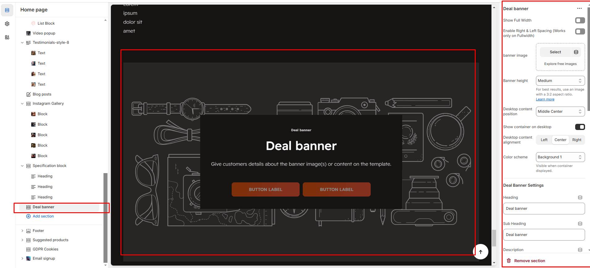

# Deal banner

The **Deal Banner Section** allows you to highlight special offers, limited-time discounts, or featured collections with a countdown timer, images, and promotional content.


* **Go to** Shopify Admin > **Online Store > Themes**.
* Click **Customize** on your active theme.
* In the Theme Editor, click **Add Section > Deal Banner**.


<figure><figcaption></figcaption></figure>

* **Show Full Width:** Expands the section across the entire screen width.
* &#x20;**Right & Left Spacing :** Add **spacing** to the **Full Width** layout (applies  in full-width mode).
* **Banner image:** Add background image to the banner.
* **Banner height:** Adjustment of banner height can done using **(small, medium, large)** options.
* **Desktop content position:** Can position the banner in **(Top, bottom,middle )** with the alignment of **(Center,Left,Right)**
* **Show Container on Desktop:** Toggle to structure the content in a container.
* **Desktop content alignment:**&#x43;an position the content with the alignment of **(Center,Left,Right)**
* **Color scheme :** You can customize the section’s appearance by changing the **text color, background color**, and more using preset color options.

### Deal banner settings

* **Titles:** Add the **title,descriptions and subtitle** to the deal banner
* **Deal End Date:** Enter the date as the Format should be 25 JAN 2025
* **Button Label:** Add text (e.g., "Shop Now").&#x20;
* **Button Link:** Set the URL destination.
* &#x20;**Use outline button style:** Change the button to an outlined style.&#x20;


Follow the same method for second  button


* **Enable Two Column Section:** Separate the section as list type in desktop and grid style in another devices
* **Padding:** Top Padding and Bottom Padding are used to adjust the spacing above and below a section in Shopify, improving the layout and readability.

