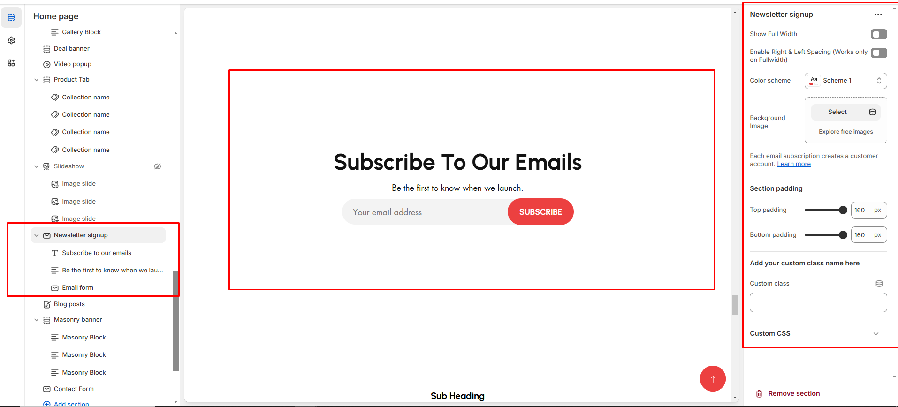

# Email signup

The **Email Signup Section** allows customers to **subscribe to your newsletter**, helping you grow your email marketing list and keep customers updated on promotions, news, and exclusive offers.


* **Go to** Shopify Admin > **Online Store > Themes**.
* Click **Customize** on your active theme.
* In the Theme Editor, click **Add Section > Email Signup**.


<figure><figcaption></figcaption></figure>

* **Show Full Width:** Expands the section across the entire screen width.&#x20;
* **Color scheme :** You can customize the section’s appearance by changing the **text color, background color**, and more using preset color options.
* **Padding:** Top Padding and Bottom Padding are used to adjust the spacing above and below a section in Shopify, improving the layout and readability.&#x20;
* [**Custom class:**](custom-class.md) The Shopify allows you to apply unique CSS styles to specific sections, blocks, or elements within your theme.


Without adding block to Email signup the section seems to be empty


* **Heading block:**&#x53;et a custom title and can Choose for size Small, Medium, or Large&#x20;
* **Paragraph block:** Can add the description to the email and choose the style as **(Body, subtitle)**
* **Email form :**&#x44;isplay on deafult&#x20;
