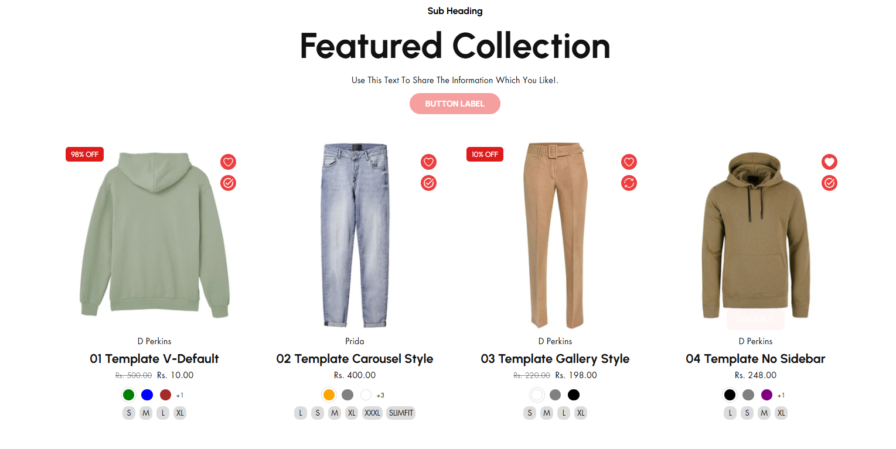
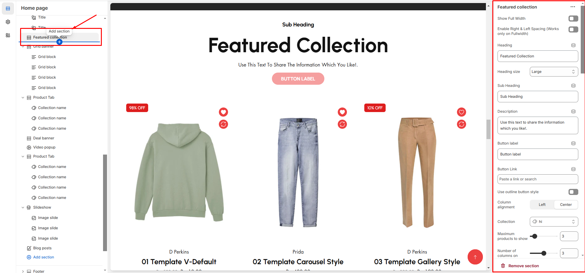

# Featured Collection

The **Featured Collection** section in Shopify allows you to highlight a specific collection of products on your store's homepage or other pages. This is a great way to showcase popular, new, or seasonal items.


* **Navigate to** **Shopify Admin > Online Store > Themes**.
* **Click** Customize on your active theme.
* **In the Theme Editor**, click **Add Section >  Featured collection**


<figure><figcaption></figcaption></figure>


Create a product and assign the created collection in the customizer


* **Show Full Width:** Expands the section across the entire screen width.
* **Right & Left Spacing :** Add **spacing** to the **Full Width** layout (applies  in full-width mode).
* **Heading:** Set a custom title (**e.g., "Hot & Top Trends"**).
* **Heading Size:** Choose from **Small, Medium, or Large** (**Default: Medium**).
* **Subheading:** Add additional text if needed.
* **Body Text:** Add a description (**e.g., "Best arrivals this week"**).
* **Button Label:** Add text (**e.g., "Shop Now"**).
* **Button Link:** Set the URL destination.
* **Use Outline Button style:** Change the button to an outlined style.
* **Column alignment:** Column can be aligned as per the content alignment requirement **(Left,Right)**
* &#x20;**Collection:** Choose a collection assigned in backend **(**[**Product Creations)**](../product/creating-products.md)  [**(creating collection)**](../collections/creating-collections.md)**.**
* **Maximum  Products to Show:** Define how many products to display totally.
* **Number of columns on desktop:** Choose how many items appear in a row on desktop.
* **Show "View All" Button:** Enable to display a **View All** button click to display all collection.
* **"View All" Button Style:** There are 2 types of button can choose either solid button or outline button.
* **Color scheme :** You can customize the section’s appearance by changing the **text color, background color**, and more using preset color options.

***

<figure><figcaption></figcaption></figure>

* **Image Ratio:** There are 3 option image ratio as **( Adapt to image, square, and portrait) .**&#x43;an choose the required style as theme requirement&#x20;
* **Show Second Image on Hover:** Display an alternate image when hovering.
* **Show Vendor:** Display the product vendor name.
* **Show New Tag:** Highlight newly added products as badge.
* **Show Product Rating:** Requires a Product Rating App to display the product rating **(**[**App integration**](broken-reference)**).** Will display on adding rating to the particular product
* **Slider option:** The **range for displaying products** can be adjusted based on the device type (**Desktop, Laptop, Tablet, and Mobile**) to ensure a responsive layout.
* **Pagination (Dots):** Show navigation dots for better user interaction.
* **Navigation (Arrows):** Enable left/right navigation arrows.
* **Auto Play Interval:** Set the time delay between slides.
* **Enable Swipe on mobile:** Allow users to swipe through blocks on touch devices.
* **Enable Controls:** Display manual navigation options.
* **Column on mobile:** Adjust based on mobile screen size can adjust to 1 column or 2 column..(works only the mobile swiper works)

***
