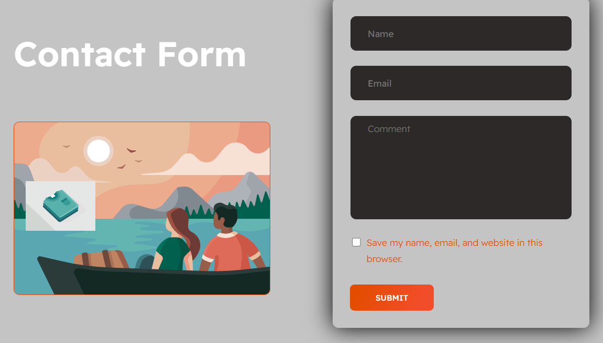
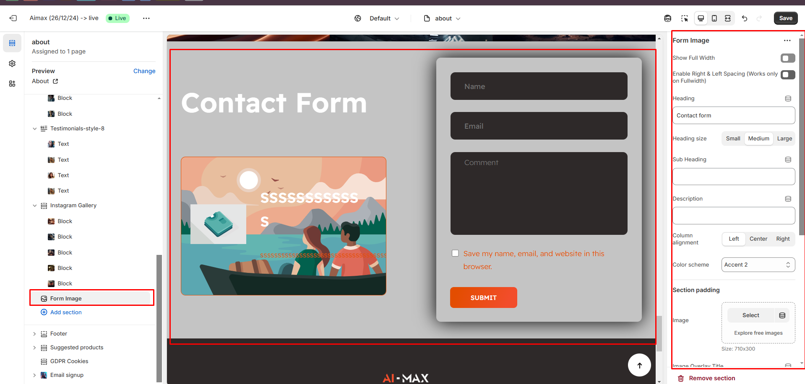

# Form Image

The **Form Image Section** allows you to display a **contact form alongside an image**, helping customers easily get in touch while maintaining a visually appealing layout.


* **Go to** Shopify Admin > **Online Store > Themes**.
* Click **Customize** on your active theme.
* In the Theme Editor, click **Add Section > Form Image**.


<figure><figcaption></figcaption></figure>

* **Show Full Width:** Expands the section across the entire screen width.&#x20;
* **Right & Left Spacing :** Add **spacing** to the **Full Width** layout (applies  in full-width mode).
* **Heading:** Set a custom title (e.g., "Hot & Top Trends").&#x20;
* **Heading Size:** Choose for size Small, Medium, or Large
* &#x20;**Subheading:** Add additional text if needed.&#x20;
* **Body Text:** Add a description (e.g., "Best arrivals this week").&#x20;
* **Color scheme :** You can customize the section’s appearance by changing the **text color, background color**, and more using preset color options.
* **Column alignment:** Column can be aligned as per the content alignment requirement (Left,Right,Center)
* **Padding:** Top Padding and Bottom Padding are used to adjust the spacing above and below a section in Shopify, improving the layout and readability.
* **Image :**&#x55;pload the image that appears left to form
* **Image Overlay Title:** The Title that appears above the image
* **Image Overlay Description:**&#x54;he description that appears above the image
* **Image Overlay Icon:**&#x54;he image that appears above the image\
  &#x20;

<figure><figcaption></figcaption></figure>

