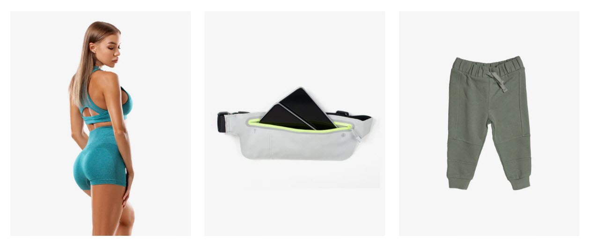
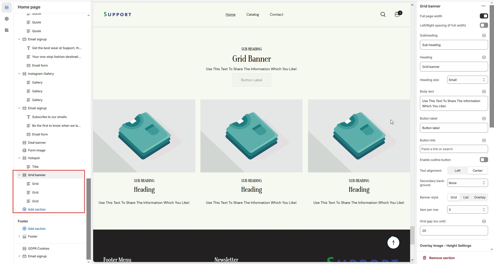
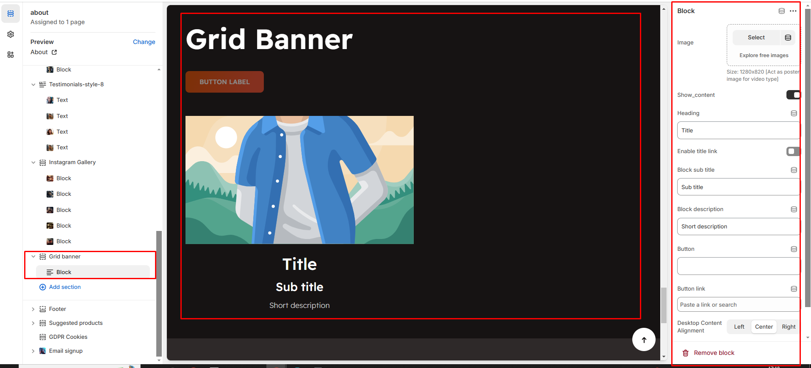

# Grid banner

The **Grid Banner Section** allows you to display multiple banners in a structured grid layout, making it ideal for showcasing promotions, featured categories, or brand messages.


* **Go to** Shopify Admin > **Online Store > Themes**.
* Click **Customize** on your active theme.
* In the Theme Editor, click **Add Section > Grid Banner**.


<figure><figcaption></figcaption></figure>

* **Show Full Width:** Expands the section across the entire screen width.&#x20;
* **Right & Left Spacing :** Add **spacing** to the **Full Width** layout (applies  in full-width mode).
* **Heading:** Set a custom title (e.g., "Hot & Top Trends").&#x20;
* **Heading Size:** Choose for size Small, Medium, or Large&#x20;
* **Subheading:** Add additional text if needed.&#x20;
* **Body Text:** Add a description (e.g., "Best arrivals this week").
* &#x20;**Button Label:** Add text (e.g., "Shop Now").&#x20;
* **Button Link:** Set the URL destination.&#x20;
* **Color scheme :** You can customize the section’s appearance by changing the **text color, background color**, and more using preset color options.
* **Enable Outline Button:** Change the button to an outlined style.
* **Column Alignment:** Adjust content placement within the sectio&#x6E;**.(Left,Center)**
* **Secondary Background:** Allow to disable the background or obtain the given background
* **Banner style:**&#x43;an style the banner with 3 option Grid, List and Overlay
* **Item Per Row:**&#x44;isplay the block to be display per row
* **Column Gap:**&#x4F;btain to give space for the column **(works only if the slider is disable)**
* **Overlay image height settings:** Used to adjust the height of the image on **(desktop,laptop,tablet and mobile) (works only in overlay style)**
* **Padding:** Top Padding and Bottom Padding are used to adjust the spacing above and below a section in Shopify, improving the layout and readability.
* [**Custom class:** ](custom-class.md)The Shopify allows you to apply unique CSS styles to specific sections, blocks, or elements within your theme.&#x20;
* **Slider option:** The range for displaying products can be adjusted based on the device type (Desktop, Laptop, Tablet, and Mobile) to ensure a responsive layout.&#x20;
* **Pagination (Dots):** Show navigation dots for better user interaction.
* &#x20;**Navigation (Arrows):** Enable left/right navigation arrows.&#x20;
* **Auto Play Interval:** Set the time delay between slides.

<figure><figcaption></figcaption></figure>


Without adding block to grid banner the section seems to be empty


* Click **Add Grid** to insert a new grid item.
* **Upload Image:** Add a high-quality image&#x20;
  * Acts as a poster image for **video-type banners**.
* **Show Content:** Toggle ON to display text and buttons.
* **Subheading:** Add a short text above the heading.
* **Heading:** Enter the banner title.
* **Enable Heading Link:** Make the heading clickable.
* **Description:** Provide additional details about the grid item.
* **Button Label & Link:** Customize the CTA button and add a destination URL.
* **Text Alignment (Desktop):** Adjust text placement. **(Left,Right,Center)**
* **Content Reverse:**&#x4F;n enable the Position of the content is row-reverse or column reversed

<figure><figcaption></figcaption></figure>
