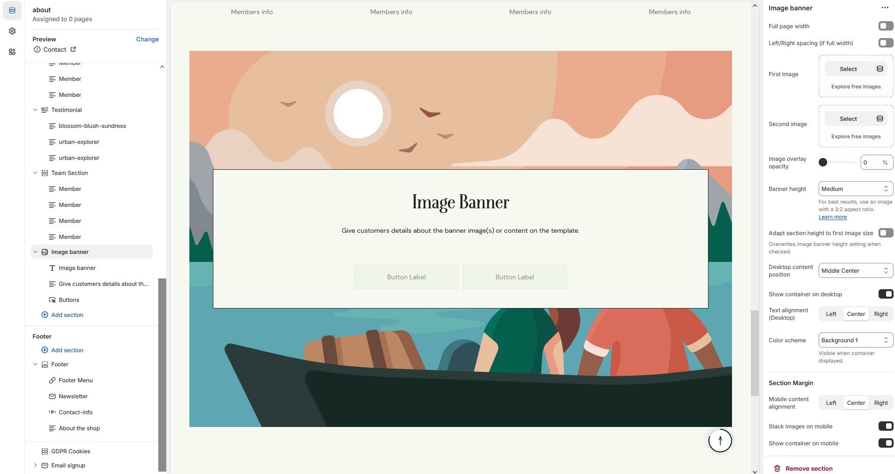

# Image banner

The **Image Banner Section** allows you to display **high-quality images with text overlays**, making it ideal for showcasing promotions, brand messages, or featured collections.

<figure><figcaption></figcaption></figure>


* **Go to** Shopify Admin > **Online Store > Themes**.
* Click **Customize** on your active theme.
* In the Theme Editor, click **Add Section > Image Banner**.


<figure><figcaption></figcaption></figure>

* **Show Full Width:** Expands the section across the entire screen width.&#x20;
* **Right & Left Spacing :** Add **spacing** to the **Full Width** layout (applies  in full-width mode).
* **First Image:** Upload the primary banner image.
* **Second Image:** Upload an alternate banner image **(optional)**.
* **Image Overlay Opacity:** Adjust transparency to enhance text readability.
* **Banner Height:** Choose **Small, Medium, or Large** as per requirement of the theme.
* **Adapt Section Height to First Image Size:** Overrides the **Banner Height** as first image setting when enabled.
* **Desktop Content Position:** Set the content alignment (**Top**, **Middle ,Bottom**).with the alignment of **(Left,Right,Center)**
* **Show Container on Desktop:** Toggle to structure the content in a container.
* **Desktop Content Alignment :** Adjust content placement within the banner.**(Left,Right,Center)**
* **Color scheme :** You can customize the section’s appearance by changing the **text color, background color**, and more using preset color options.
* **Mobile Content Alignment:** Adjust content placement for mobile users..**(Left,Right,Center)**
* **Stack Images on Mobile:** Enable to stack images vertically instead of side by side.
* **Show Container on Mobile:** Display structured content on mobile screens.
* **Margin Top:** Adjust spacing above the banner.
* **Margin Bottom:** Adjust spacing below the banner.
* [**Custom class:** ](custom-class.md)The Shopify allows you to apply unique CSS styles to specific sections, blocks, or elements within your theme.


Without adding block to banner the section seems to be empty


* **Search:** Use to add search key search tags &#x20;
* **Heading block:** Set a custom title and can Choose for size Small, Medium, or Large&#x20;
* **Text block:** Can add the description to the email and choose the style as **(Body, subtitle)**
* **Buttons:** Button Label Add text (e.g., "Shop Now").& Button Link Set the URL destination.
* **Use Outline Button style:** Change the button to an outlined style.

<figure><figcaption></figcaption></figure>
