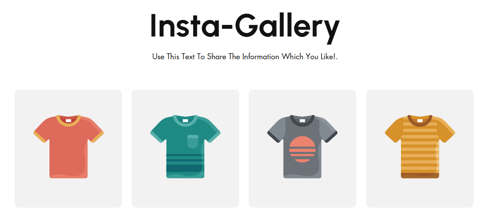
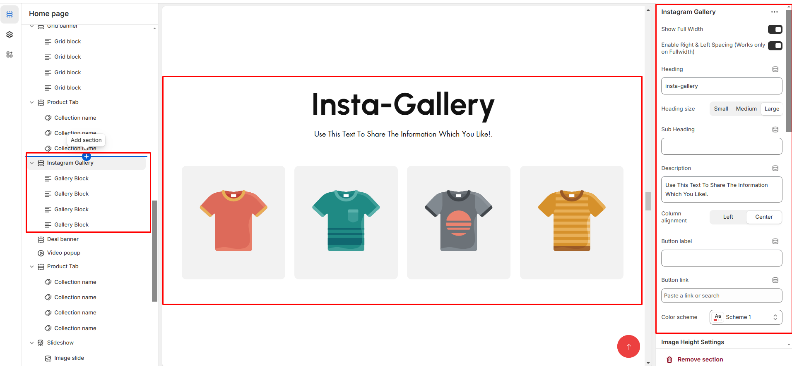
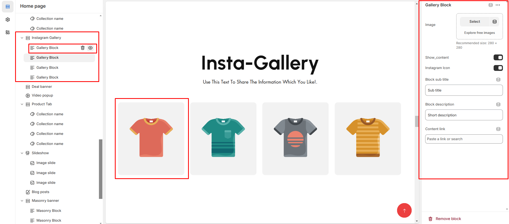

# Instagram Gallery

Instagram is one of the most influential social platforms that can attract potential customers. Using it in your store can be a tactic move.

<figure><figcaption></figcaption></figure>


* Go to **Online Store > Themes > Customize**.
* Navigate to the section for **Click and Add Instagram Gallery** (or add it via "Add Section" if not already added).


* **Show Full Width:** Expands the section across the entire screen width.
* **Right & Left Spacing :** Add **spacing** to the **Full Width** layout (applies  in full-width mode).
* **Heading:** Set a custom title (e.g., **"Heading"** ).&#x20;
* **Heading Size:** Choose for size Small, Medium, or Large.
* &#x20;**Subheading:** Add additional text if needed. &#x20;
* **Add a description:**&#x50;rovide a short description of the content. (e.g., "Best arrivals this week").&#x20;
* **Button Label:** Add text (e.g., "Shop Now").&#x20;
* **Button Link:** Set the URL&#x20;
* **Color scheme :** You can customize the section’s appearance by changing the **text color, background color**, and more using preset color options.
* &#x20;**Use Outline Button style:** Change the button to an outlined style.&#x20;
* **Column alignment:** Column can be aligned as per the content alignment requirement (Left,Right)
* **Image height:** The height of the image can be alter as per the requirement of the **(Desktop, Laptop,Tablet and Mobile)**
* **Padding:** Top Padding and Bottom Padding are used to adjust the spacing above and below a section in Shopify, improving the layout and readability.
* **Slider option:** The range for displaying products can be adjusted based on the device type **(Desktop, Laptop, Tablet, and Mobile)** to ensure a responsive layout.
* &#x20;**Pagination (Dots):** Show navigation dots for better user interaction.
* &#x20;**Navigation (Arrows):** Enable left/right navigation arrows.
* &#x20;**Auto Play Interval:** Set the time delay between slides.
* &#x20;**Enable Swipe on mobile:** Allow users to swipe through blocks on touch devices.
* &#x20;**Enable Controls on mobile:** Display manual navigation options.&#x20;
* **Column on mobile:** Adjust based on mobile screen size can adjust to 1 column or 2 column..(works only the mobile swiper works)
* [**Custom class**](custom-class.md)**:** The Shopify allows you to apply unique CSS styles to specific sections, blocks, or elements within your theme.

<figure><figcaption></figcaption></figure>


Without adding block to Instagram  the section seems to be empty


* **Image:** Add the image to Instagram gallery for the block
* **Show content:** Enables the content as overlay to the image
* **Instagram Icon:** Display the icon of instagram to the block&#x20;
* **Block sub title:** Display the additional text to the block
* **Block description:** Display the body text to the instagram
* **Button link:** Display the link to icon to connect another page
* **Desktop content position:** Can position the banner in **(Top, bottom,middle )** with the alignment of **(Center,Left,Right)**

<figure><figcaption></figcaption></figure>
